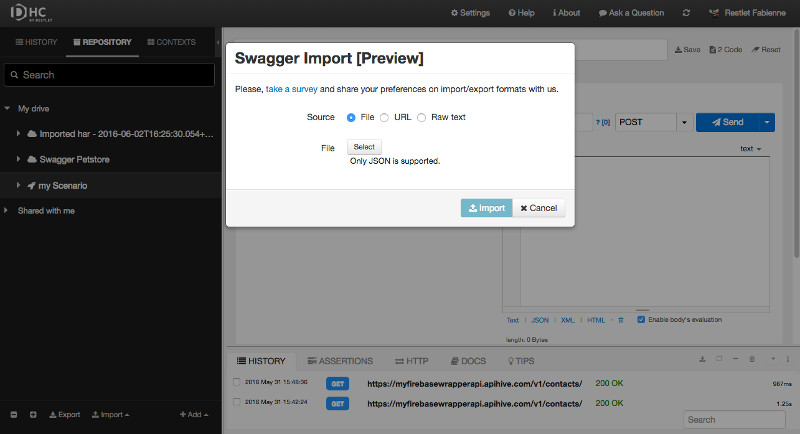
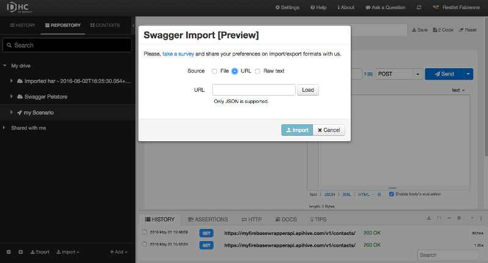
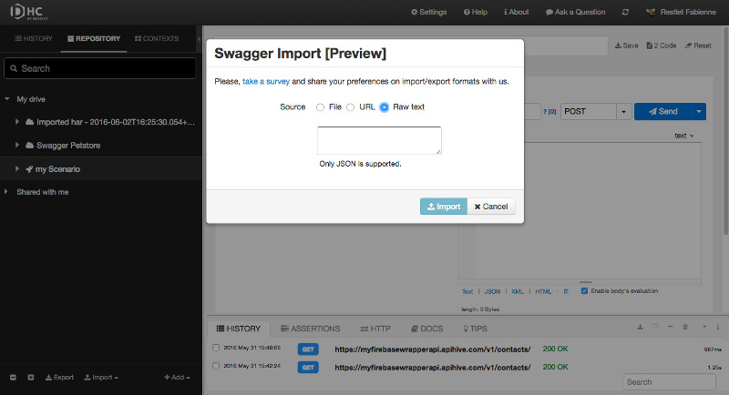

# Introduction

DHC allows you to import a Swagger 2.0 API definition from a JSON file or from a URL.

## from a JSON file

From the **Repository** tab, click **Import** and select **Import Swagger 2.0**.  

Select **File** as a Source (default).  
Click **Select** and pick up a JSON file that contains an API definition.  
Click **Import**.

>**Note:** This feature is currently in *Preview* mode as we only import version 2 of Swagger and only its JSON variant for the moment.   

## from a URL

From the **Repository** tab, click **Import** and select **Import Swagger 2.0**.  
Select **URL** as a Source.  
Enter the **URL** that contains your API definition and click **Load**.  
Click **Import**.

## from raw text

From the **Repository** tab, click **Import** and select **Import Swagger 2.0**.  
Select **Raw text** as a Source.  
Paste JSON code that contains your API definition.  
Click **Import**.

