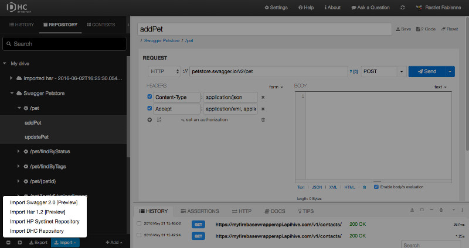
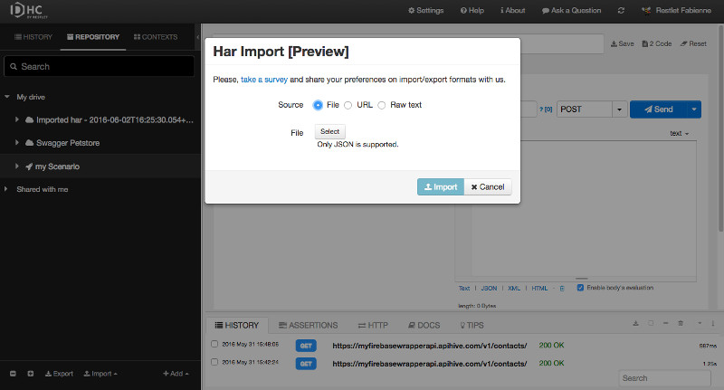
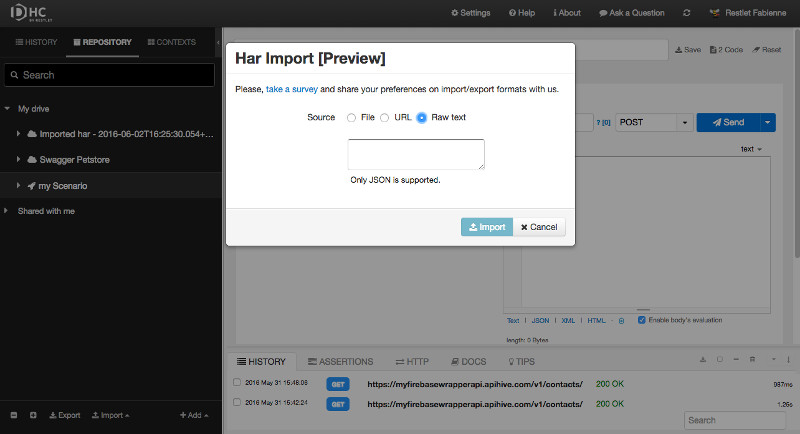
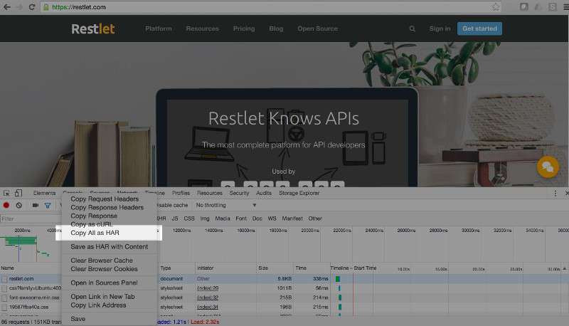
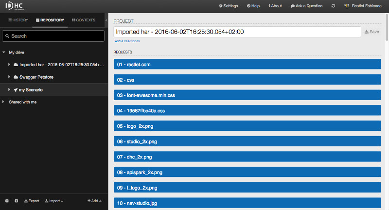

# Introduction

DHC allows you to import a definition in HAR 1.2 format. HAR (HTTP Archive format) is a JSON-formatted archive file format for logging of a web browser's interaction with a site.

HAR import allows users to import a full set of requests easily using the HAR format.

HAR is used by the Chrome browser to export requests executed from the browser.

>**Note:** This feature is available from the Solo plan.

## from a JSON file

From the **Repository** tab, click **Import** and select **Import Har 1.2**.  

Select **File** as a Source (default).  
Click **Select** and pick up a JSON file that contains an API definition.  
Click **Import**.

## from a URL

From the **Repository** tab, click **Import** and select **Import Har 1.2**.  
Select **URL** as a Source.  
Enter the **URL** that contains your API definition and click **Load**.  
Click **Import**.

## from raw text

From the **Repository** tab, click **Import** and select **Import Har 1.2**.  
Select **Raw text** as a Source.  
Paste JSON code that contains your API definition.  
Click **Import**.

# HAR import example

You may be willing to import requests from a webpage. Let's try it with our restlet.com webpage:  

From Chrome's **Network** tab, right click and select **Copy all as HAR**.

From DHC's **Repository** tab, click **Import** and select **Import Har 1.2**.  
Select **Raw text** as a **Source**.  
Paste your clipboard content in the text area below and click **Import**.

