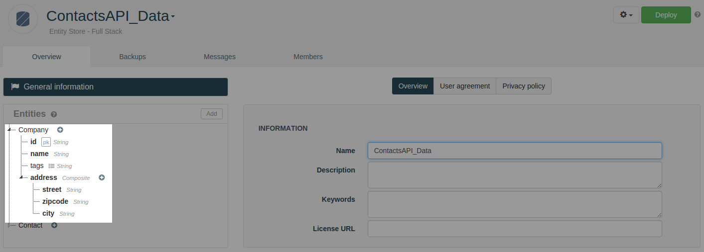
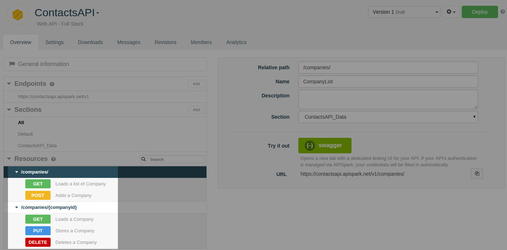
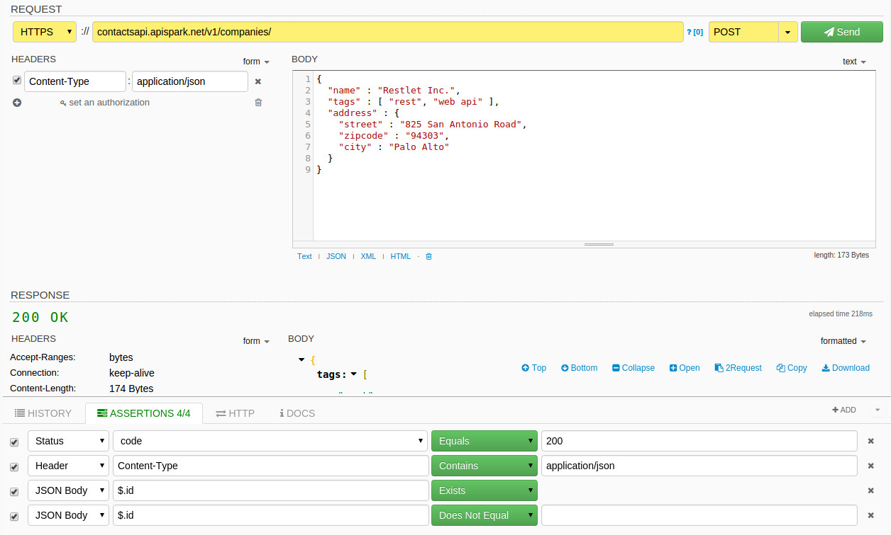
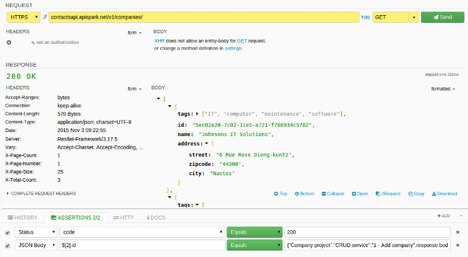
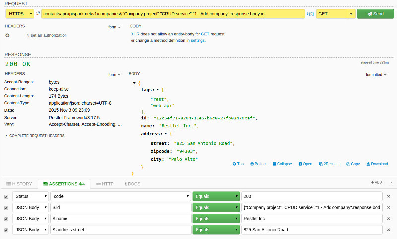
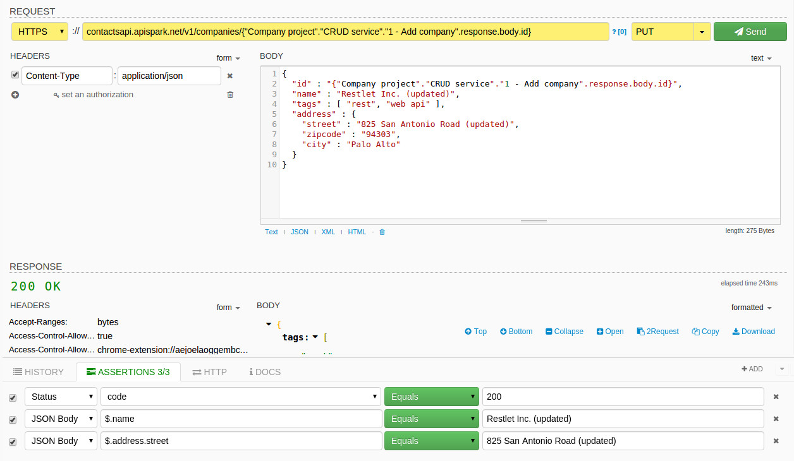
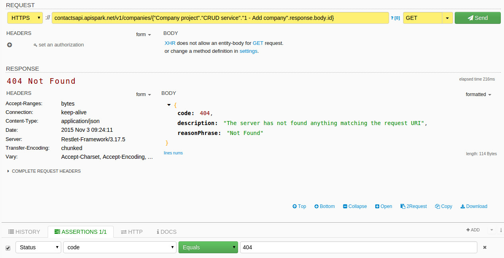

For this use case, we will test a RESTful service that provides CRUD operations for a specific entity.

# Overview

In our sample, we will use a company entity with the following structure:

The corresponding service provides the following resources and HTTP methods to manage companies:

All our requests will be stored into a service named *CRUD service* under the project *Company project*. These names will be used below in expressions.

# Add a new company

Let’s create a request in DHC by Restlet to add an element. The assertions here could be the expected *status code* (200), the *content type* (application/json) and the presence of an non empty attribute named *id*. Here is the content of such a request:

# Check companies

Let’s check that the company we just added actually appears in the list of companies. We can use the same resource but with the *GET* method. Since we already had two companies, we would expect this company to be in the third position. What is interesting here is that we can use the content of the previous request within our assert statement to check that the company identifier is the right one. For this, we will use the following expression in the assertion for the identifier:

<pre class="language-none"><code class="language-none">{"Company project"."CRUD service"."1 - Add company".response.body.id}
</code></pre>

Let’s check that the request for this company returns the right data. In this case, we use the previous expression directly within the URL of the request. This guarantees the use of the right company identifier. Assertions can test the content of the response payload in greater detail.

# Update an existing company

It is now time to update our company. We will use a *PUT* method for this with the new content of the company. Within assertions, we can check that the new values of fields were correctly taken into account.

# Delete an existing company

To let data in a proper state, we need to delete the previously created company. In this case, we will simply check the status code (204) and that the content is empty.

# Check the deleted company

The last step is to check that the element was actually deleted. To do this let’s try to get the company with the previous identifier. We expect to get a status code 404 here since it does not exist anymore.

# Build our test scenario

Here is a recap of all requests we implement within DHC to test our RESTful service. They correspond to our test scenario.

# Conclusion

DHC provides a powerful feature based on assertions to check that responses correspond to expectations. Expressions and JSON path can be used at this level making the support very powerful and provides the possibility to leverage every element present in the workspace. This allows you to fully test real-world RESTful services.
