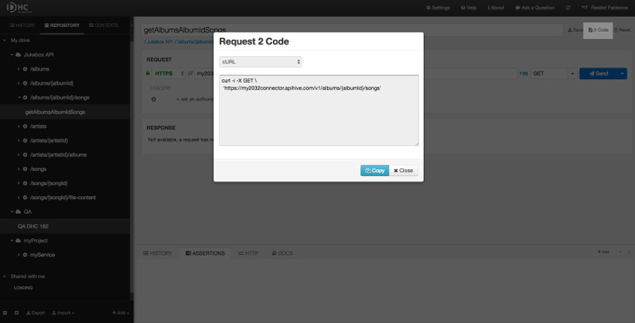

DHC allows you to export the request as code in curl language. This can be very handy if you like to work in command-line.

Click on the **2 Code** button on top right of the screen to get the corresponding curl code.

