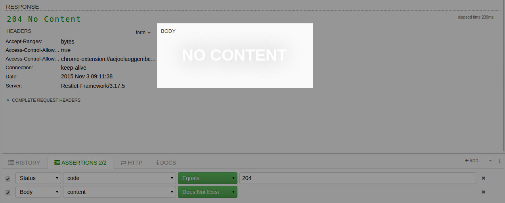
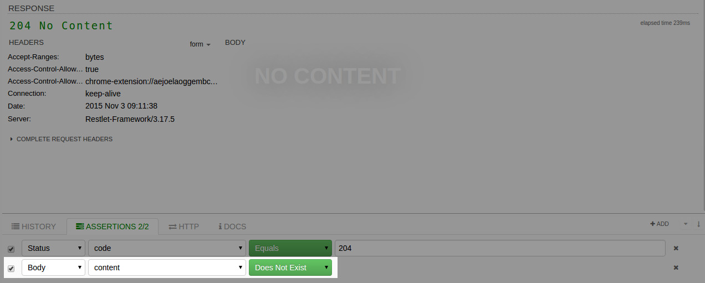

The first part is obviously the status one. In this case, you can choose not only the status code but the status message as well.

Regarding response headers, DHC allows you to check both their presence and their content. In the first instance, you can simply put the name of the header in the parameter field and use the **Exists** or **Does not exist** comparison operators, as shown below:

Checking the header value is pretty simple, just change the comparison operator to **Equals** or **Contains** for example and fill the value field with the expected value.

Just as you do for headers, you can also check either the presence or content of a payload. The first case is interesting for responses with empty payloads, typically with status code 204.

On this screenshpt, the response payload is empty:

Here we check that the response payload is actually empty:

For text-based payload, structured or not, it is possible to check if the content matches to a specific value, or contains some text, as described below.

The response payload is not empty:

Here we check if the keyword *Restlet* is present in the response payload:

Testing text payload can be tedious if they are only considered as text. For this reason, DHC goes further by natively supporting JSON body. The latter allows to apply specific JSON path expressions. We will focus on this feature in the next section.

Before diving into JSON payload, do not forget the support for the response itself. This allows you to apply assertions to its latency. This is particularly useful if you want to test the maximum time for a call.

