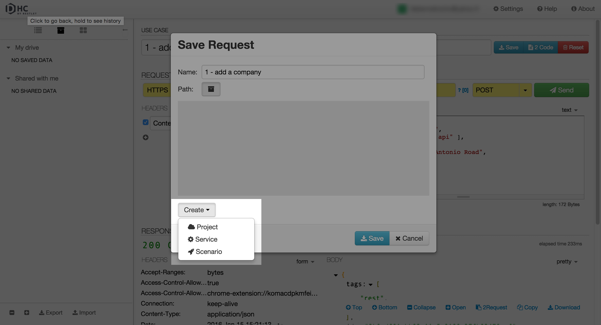
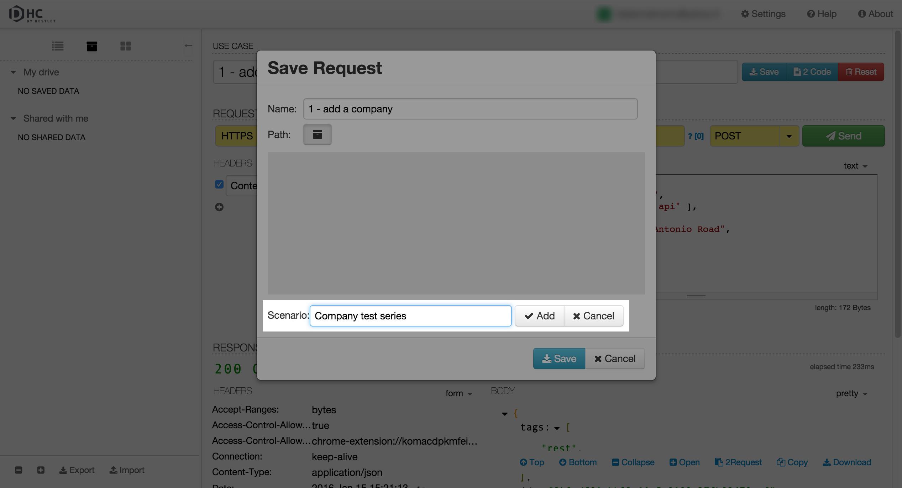
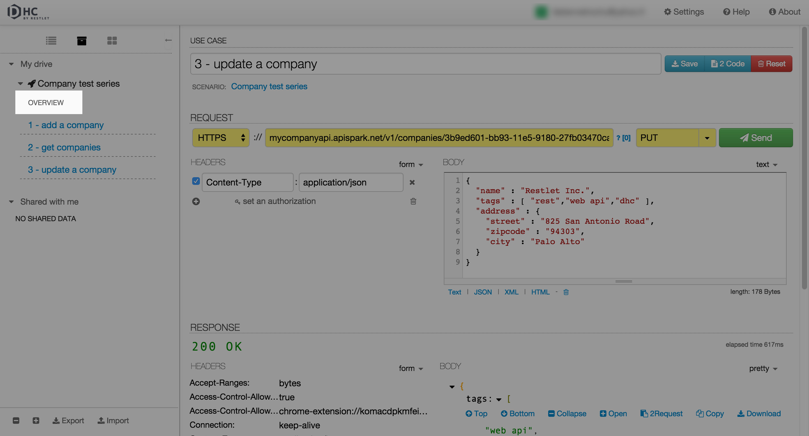

# Introduction

DHC allows you to launch series of tests in only one click.

You only need to save a series of requests inside a scenario and to launch it by clicking **Run scenario**.

# Create a scenario

Create a request an save it by clicking the **Save** button..

Save your request inside a scenario: click the **Create** drop-down menu and select **Scenario**.

Enter a Name for your **Scenario** and click **Add**.

You can now save your request inside the scenario you created.

Save several requests inside your scenario.

# Launch a test scenario

From the left panel, click on the **Overview** item underneath your Scenario name.

In the central panel, click **Run scenario**.

Your requests launch automatically one after the other.

