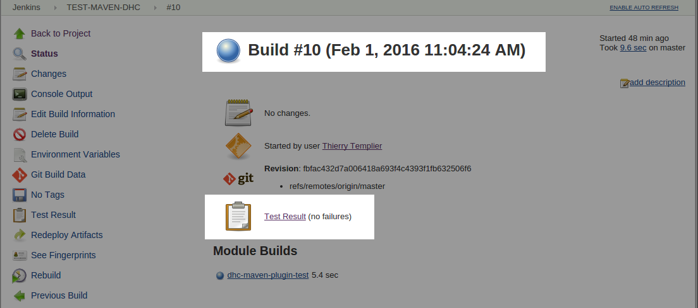
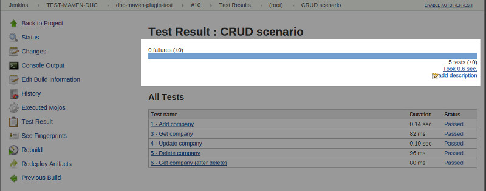
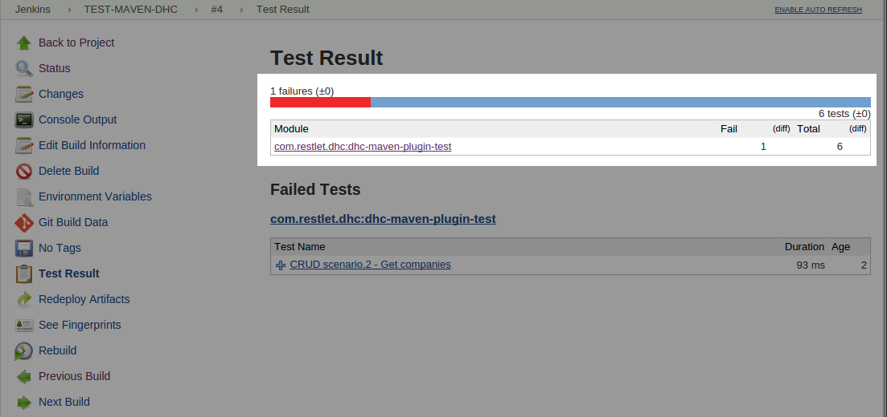

With the [Maven plugin](./test-reports-maven "Maven plugin"), we have taken a step towards industrialization. We can go even further by integrating it within continuous integration with tools like *Jenkins*. This will allow us to automate builds and test executions.

To bring the Restlet Client into Jenkins:

Create a project that uses the pom.xml file previously created.  
Select the appropriate project type (**Maven** here).


To configure where to get the source for your project, push the corresponding content into a Github repository, for example: select **Git** as a **Source Code Management** and fill in the **Repository URL**.


To configure the pre-build steps, define where the pom.xml file to use is located (**Root POM**) and which goals you need to execute: specify the *clean* and *test* **Goals** to run tests using the Restlet Client Maven plugin.


The project is now correctly configured.  
You can launch a build for your project directly from the Jenkins Web UI.

>**Note:** To facilitate the Root POM path specification, you can leverage the Maven ```project.basedir``` variable, as described below.  
For more infomation please jump to the [Maven plugin page](./test-reports-maven "Maven plugin").

To launch the build, click on the **Build Now** menu. It displays in the **Build History** section in real time.


Each build has a dedicated page that shows details about its execution and results.



The Test Result page gives you access to the result details whether the build was successful or not.




