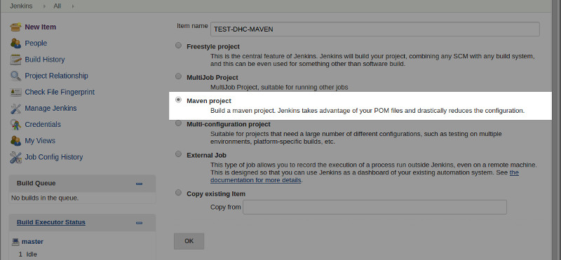
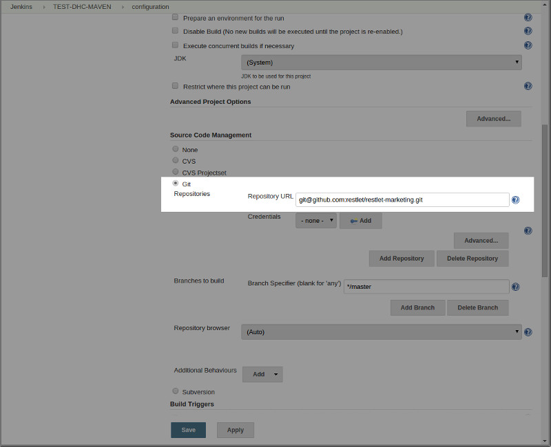
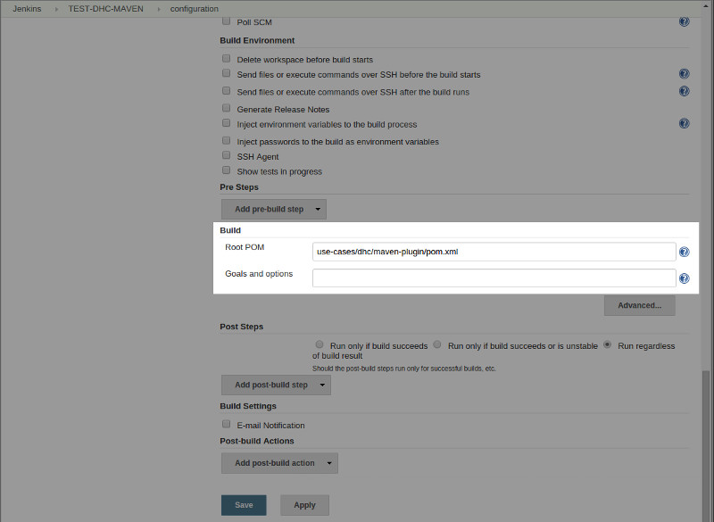
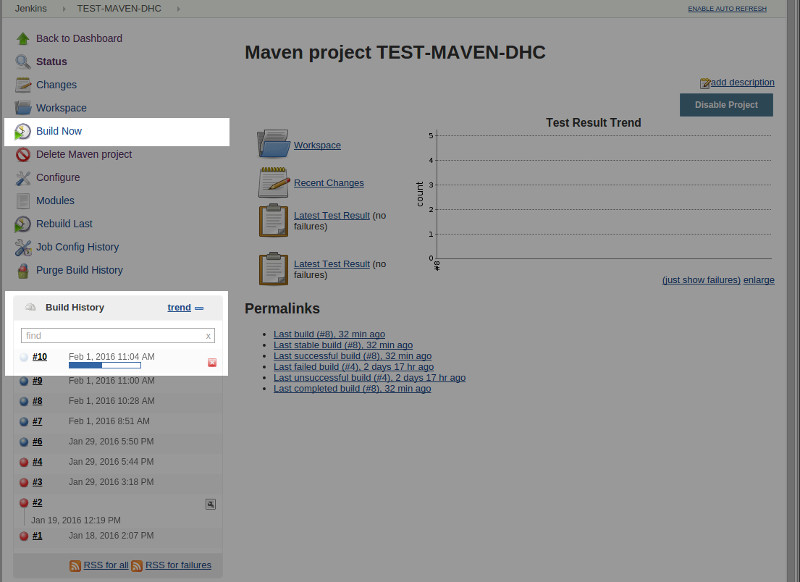
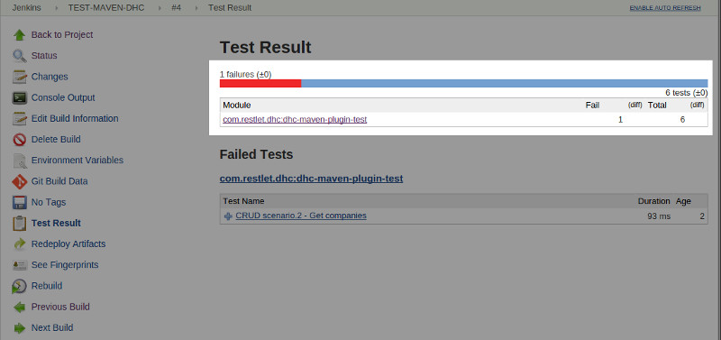

With the [Maven plugin](/technical-resources/dhc/guide/run-tests/automate-tests/test-reports-maven "Maven plugin"), we have taken a step towards industrialization. We can go even further by integrating it within continuous integration with tools like *Jenkins*. This will allow us to automate builds and test executions.

To bring DHC into Jenkins:

Create a project that uses the pom.xml file previously created.  
Select the appropriate project type (**Maven** here).



To configure where to get the source for your project, push the corresponding content into a Github repository, for example: select **Git** as a **Source Code Management** and fill in the **Repository URL**.



To configure the pre-build steps, define where the pom.xml file to use is located (**Root POM**) and which goals you need to execute: specify the *clean* and *test* **Goals** to run tests using the DHC Maven plugin.



The project is now correctly configured.  
You can launch a build for your project directly from the Jenkins Web UI.

>**Note:** To facilitate the Root POM path specification, you can leverage the Maven ```project.basedir``` variable, as described below.
<pre class="language-html"><code class="language-html">&lt;build&gt;
  &lt;plugins&gt;
    &lt;plugin&gt;
      &lt;groupId&gt;com.restlet.dhc&lt;/groupId&gt;
      &lt;artifactId&gt;dhc-maven-plugin&lt;/artifactId&gt;
      &lt;version&gt;1.1.0.1&lt;/version&gt;
      &lt;executions&gt;
        &lt;execution&gt;
          &lt;phase&gt;test&lt;/phase&gt;
          &lt;goals&gt;
            &lt;goal&gt;test&lt;/goal&gt;
          &lt;/goals&gt;
          &lt;configuration&gt;
            &lt;file&gt;${project.basedir}/company-scenario.json&lt;/file&gt;
          &lt;/configuration&gt;
        &lt;/execution&gt;
      &lt;/executions&gt;
    &lt;/plugin&gt;
  &lt;/plugins&gt;
&lt;/build&gt;
</code></pre>

To launch the build, click on the **Build Now** menu. It displays in the **Build History** section in real time.



Each build has a dedicated page that shows details about its execution and results.


The Test Result page gives you access to the result details whether the build was successful or not.



