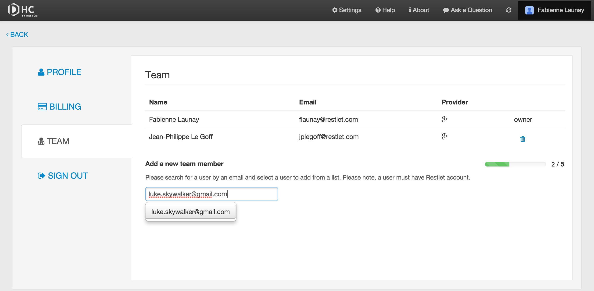

If you subscribed to a Team plan or a Scale plan, then you can add members to your Team.

The **Team** page gives you a list of the different members of your team (with their email address and provider). You appear as the owner and your team members can be removed from the team.

To navigate to the **Team** page, make sure you are signed in, then click on your username on top right of your screen and select the **Team** tab.

Provided your plan allows it, you can add new members by entering their email address in the input field at the bottom of the page. A progress bar indicates whether you can still add new members e.g. 2/5.

