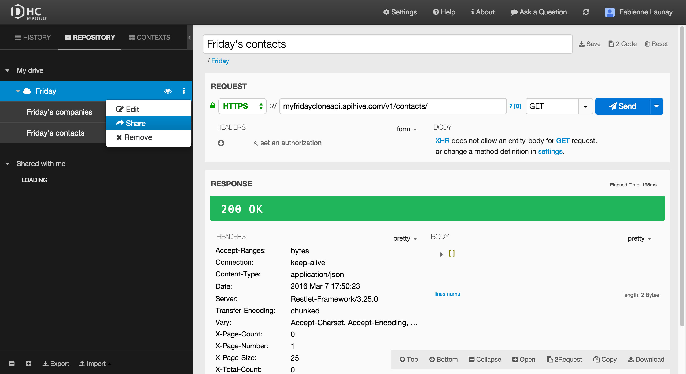
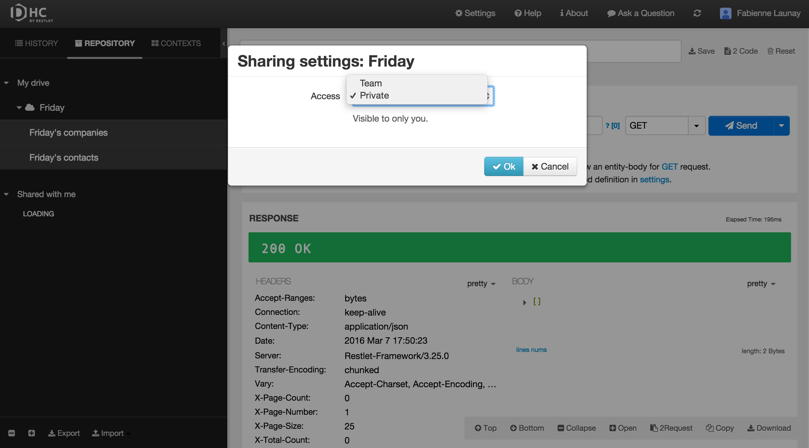

Once you have added members to your team, you can decide to share some of your projects with them. Your projects can be either **Private** or accessible to your whole **Team**. They are private by default. Note that in **Team** mode, your members will be granted read and write access.

If you wish to share a project, right click on the project from the left panel and select **Share**.

Set your project access to **Team**.

