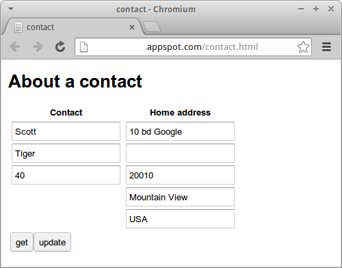
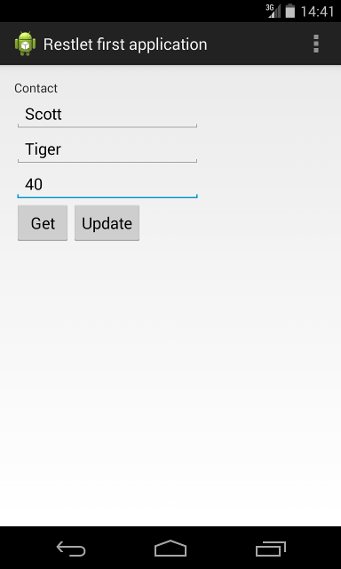

# Introduction

This first application illustrates how to develop a Restlet application
that combines several editions of the Restlet Framework : GAE, GWT,
Android and Java SE. It explains the benefits of annotated Restlet
interfaces and of the ConverterService that offers transparent
serialization between Restlet representations and Java objects, usable
between a server application and several kind of clients.

# Table of contents

1.  [Requirements](#requirements)
2.  [Scenario](#scenario)
3.  [Archive content](#archive-content)
4.  [Common classes](#common-classes)
5.  [GAE server](#gae-server)
6.  [GWT client](#gwt-client)
7.  [Android client](#android-client)
8.  [Java SE client](#java-se-client)

# <a name="requirements"></a>Requirements

It is based on the following editions of the Restlet Framework : Java SE
(JSE), Google App Engine (GAE), Google Web Toolkit (GWT) and Android
which must be downloaded separately from [this page](http://restlet.com/downloads/current).
It has been tested with the following environments:

-   Restlet Framework 2.2 RC 4
-   Google App Engine (GAE) 1.7.0
-   Google Web Toolkit (GWT) 2.5
-   Android 4

GAE doesn't support HTTP chunked encoding, therefore serialized object can't be sent (via POST or PUT) to a GAE server. Since Restlet Framework version 2.1 M4 we have a workaround available that buffers the HTTP
entity to prevent chunk encoding. To use it, call the ClientResource.setRequestEntityBuffering(boolean) method with a "true" value. Note that this workaround isn't required for the GWT edition.

# <a name="scenario"></a>Scenario

The server application is hosted on the Google App Engine (GAE) platform. For the sake of simplicity it serves only one resource named "contact", with the following characteristics:

-   its relative URI is "/contacts/123"
-   it supports the GET, PUT and DELETE methods.
-   it represents a simple "contact" object.

The "contact" object has the following attributes:

-   firstname
-   lastname
-   age
-   home address (actually an instance of a "Address" class): line1,
    line2, zipcode, city and country

 This resource will be requested for several kind of clients:

-   GWT client page
-   Android application
-   Java SE client

# <a name="archive-content"></a>Archive content

The full source code (without the required archives) is available here:
[firstapplication.zip](/technical-resources/restlet-framework/archives/examples/firstApplication/${restlet-version-minor}/firstapplication.zip "firstapplication.zip")
(application/zip, 1.0 MB)

It contains the full source code of three Eclipse projects with:

1.  Project that contains both the GAE server and the GWT client code
2.  Project that contains the source code of the Android client
3.  Project that contains the source code of the Java SE client

# <a name="common-classes"></a>Common classes

The following classes are available on the three project. They are used
by the server and the clients in order to produce the serialized
representation of the Contact object and to deserialize incoming
representations.

-   Contact
-   Address
-   ContactResource.

ContactResource is an interface annotated with Restlet annotations:


```java
public interface ContactResource {
    @Get
    public Contact retrieve();

    @Put
    public void store(Contact contact);

    @Delete
    public void remove();
}
```


It represents the contract passed between the client and the server.

When using collections of objects as method parameters, you need to use
concrete classes if you intend to have GWT clients. For example use
ArrayList\<Contact\> instead of List\<Contact\>.

# <a name="gae-server"></a>GAE server

We propose to host the server application on the GAE platform. The
server project relies on the following JAR files:

-   org.restlet.jar: core archive (*GAE edition*)
-   org.restlet.ext.gwt.jar: GWT server-side extension to convert Java objects to a GWT-specific serialization format (*GAE edition*)
-   org.restlet.ext.gae.jar: GAE server-side extension (*GAE edition*)
-   org.restlet.ext.servlet.jar: Servlet extension to deploy the Restlet application in GAE (*GAE edition*)
-   org.restlet.ext.jackson.jar: Jackson extension used to generate JSON representations of the contact resource (*GAE edition*)
-   com.fasterxml.jackson.core.jar, com.fasterxml.jackson.databind.jar, com.fasterxml.jackson.annotations.jar: archives of the Jackson libraries required by the Jackson extension, and available in the GAE edition.

See also the "readme.txt" file located in the sources file. It list also all necessary binaries taken from the GAE platform.

The server-side resource implements the annotated interface.


```java
/**
 * The server side implementation of the Restlet resource.
 */
public class ContactServerResource extends ServerResource implements ContactResource {

   private static volatile Contact contact =
        new Contact("Scott", "Tiger", new Address("10 bd Google", null, "20010", "Mountain View",
                    "USA"), 40);

    public void remove() {
        contact = null;
    }

    public Contact retrieve() {
        return contact;
    }

    public void store(Contact contact) {
        ContactServerResource.contact = contact;
    }
}
```


This resource is then exposed by the server application:


```java
    @Override
    public Restlet createInboundRoot() {
        Router router = new Router(getContext());

        // Serve the files generated by the GWT compilation step.
        router.attachDefault(new Directory(getContext(), "war:///"));
        router.attach("/contacts/123", ContactServerResource.class);

        return router;
    }
```


# <a name="gwt-client"></a>GWT client

The GWT client relies only on the core Restlet JAR (org.restlet.jar)
provided in the GWT edition.  

In order to get the Contact object, a proxy class is required. This is
an interface that inherits on a specific interface (delivered by the GWT
edition of the Restlet Framework):  


```java
public interface ContactResourceProxy extends ClientProxy {
    @Get
    public void retrieve(Result<Contact> callback);

   @Put
    public void store(Contact contact, Result<Void> callback);

    @Delete
    public void remove(Result<Void> callback);
}
```


This interface looks like the ContactResource interface, expect that it
adds a callback to each declared methods, due to the asynchronous nature
of the GWT platform and the underlying AJAX mechanism offered by web
browsers.

The type of the callback is not limited to the Result interface of the
Restlet Framework, it can also be the usual AsyncCallback interface
provided by GWT. Thus it allows you to easily migrate an existing
GWT-RPC code base to GWT-REST with Restlet.

Then, the following code allows you to request and handle the Contact
resource:


```java
ContactResourceProxy contactResource = GWT.create(ContactResourceProxy.class);

// Set up the contact resource
contactResource.getClientResource().setReference("/contacts/123");

// Retrieve the contact
contactResource.retrieve(new Result<Contact>() {
    public void onFailure(Throwable caught) {
        // Handle the error
    }

    public void onSuccess(Contact contact) {
        // Handle the contact, for example by updating the GWT interface
        // Contact fields
        cTbFirstName.setText(contact.getFirstName());
        cTbLastName.setText(contact.getLastName());
        cTbAge.setText(Integer.toString(contact.getAge()));
    }
});
```


Here is a screenshot of the GWT client page once the user has clicked on
the GET button.




In order to update the contact, simply complete your contact object and
invoke the "store" method as specified by the proxy interface:


```java
contactResource.store(contact, new Result<Void>() {
    public void onFailure(Throwable caught) {
        // Handle the error
    }

    public void onSuccess(Void v) {
        // Display a dialog box
        dialogBox.setText("Update contact");
        textToServerLabel.setText("Contact successfully updated");
        dialogBox.center();
        closeButton.setFocus(true);
    }
});
```


# <a name="android-client"></a>Android client

The Android client project relies only on the core Restlet JAR
(org.restlet.jar) provided by the Android edition of the Restlet
Framework.

The contact object will be serialized between the GAE server and the
Android client (in both directions) using the standard Java
serialization process. No additional interface is required except the
ContactResource interface furnished by the server.


```java
// Initialize the resource proxy.
ClientResource cr = new ClientResource("http://restlet-example-serialization.appspot.com/contacts/123");
// Workaround for GAE servers to prevent chunk encoding
cr.setRequestEntityBuffering(true);

ContactResource resource = cr.wrap(ContactResource.class);

// Get the remote contact
Contact contact = resource.retrieve();
```


In order to update the contact, simply use this instruction:


```java
// Update the remote contact
resource.store(contact);
```


The internal HTTP client has been rewritten using the java.nio.package.
This may lead, on some android devices, to encounter this kind of
exception: **java.net.SocketException: Bad address family**. In this
case, you can turn off the IPv6 preference as follow:
System.setProperty("java.net.preferIPv6Addresses", "false");

Here is a screenshot of the Android user interface.



# <a name="java-se-client"></a>Java SE client

## Get the full Contact object

The same code used on the Android application allows you to get the full
Contact object:


```java
ClientResource cr = new ClientResource("http://restlet-example-serialization.appspot.com/contacts/123");
// Get the Contact object
ContactResource resource = cr.wrap(ContactResource.class);
Contact contact = resource.retrieve();

if (contact != null) {
    System.out.println("firstname: " + contact.getFirstName());
    System.out.println(" lastname: " + contact.getLastName());
    System.out.println("     nage: " + contact.getAge());
}
```


  This code produces the following ouput on the console:

    firstname: Scott
     lastname: Tiger
          age: 40

## Get a JSON representation

In case the Contact class is not available, you can still retrieve a
JSON representation by setting the client preferences when retrieving
the resource's representation:


```java
cr.get(MediaType.APPLICATION_JSON).write(System.out);
```


which produces the following output:

    {"age":40,"firstName":"Scott","homeAddress":{"country":"USA","city":"Mountain View","line1":"10 bd Google","line2":null,"zipCode":"20010"},
    "lastName":"Tiger"}
