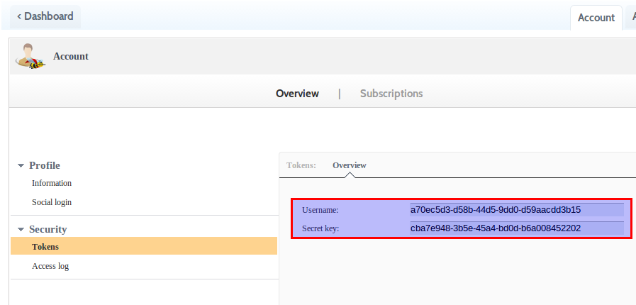
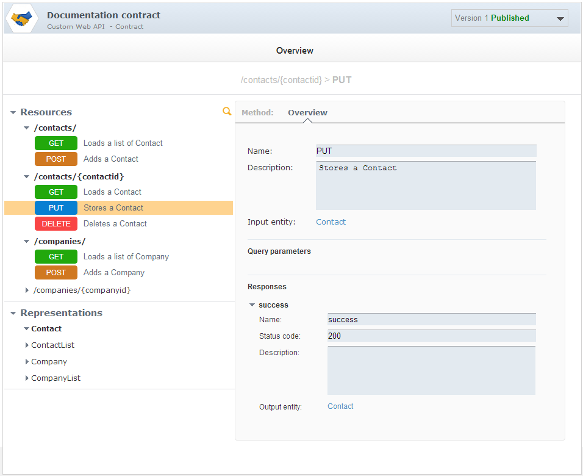

# Introduction

The Introspector tool is made to import the contract of your Web API in
the [APISpark](https://apispark.restlet.com/) full-stack PaaS for Web APIs.

It will allow you to:

-   Introspect your Restlet-based or JAX-RS Web API or parse a Swagger definition to retrieve its description
-   Display and edit this description within APISpark
-   Synchronize Web API changes initiated from your API's code or Swagger

In these scenarios we'll leverage the Introspector tool by loading a Web API definition into APISpark with the three types of inputs available. You can find a complete example of documentation generated via this tool [here](https://apispark.restlet.com/apis/1427/versions/1/overview/), the description fields weren't retrieved from the Restlet Framework code, they were added manually in APISpark.

# Launch process

In a first example, we will document a Restlet-based Web API. Users have to point the Introspector to the class extending org.restlet.Application. Here, the Application class in our code is org.restlet.api.MyContacts.

~~~~{.sh}
java -cp "/path/to/your/lib/*" org.restlet.ext.apispark.Introspector -u 55955e02-0e99-47f8 -p 6f3ee88e-8405-44c8 org.restlet.api.MyContacts
~~~~

Then we will document an API based on its Swagger definition.

~~~~{.sh}
java -cp "/path/to/your/lib/*" org.restlet.ext.apispark.Introspector -u 55955e02-0e99-47f8 -p 6f3ee88e-8405-44c8 -l swagger http://petstore.swagger.wordnik.com/api/api-docs
~~~~

And finish with a JAX-RS API.

~~~~{.sh}
java -cp "/path/to/your/lib/*" org.restlet.ext.apispark.Introspector -u 55955e02-0e99-47f8 -p 6f3ee88e-8405-44c8 org.jaxrs.api.MyContacts
~~~~

__Note:__ For the JAX-RS introspection to work, users have to point the Introspector to a class extending javax.ws.rs.core.Application and listing all the JAX-RS annotated classes as follows:

~~~~{.java}
package org.coenraets.directory;

import java.util.HashSet;
import java.util.Set;
import javax.ws.rs.core.Application;

public class MyContacts extends Application {
    @Override
    public Set<Class<?>> getClasses() {
        Set<Class<?>> classes = new HashSet<Class<?>>();
        classes.add(EmployeeResource.class);
        return classes;
    }
}
~~~~

Whether you use this class to run your Web API or not, you must create it to run the Introspector.

## Configuration

### Using maven

You can use the following pom.xml to get the dependencies required for the Introspector. The pom is available [here](http://maven.restlet.com/org/restlet/jse/org.restlet.ext.apispark/2.3.1/org.restlet.ext.apispark-2.3.1.pom).

* In a terminal, run : "mvn install"
(* To use it in eclipse, run in your terminal : "mvn eclipse:eclipse")
* Run the main class : org.restlet.ext.apispark.Introspector

~~~~{.xml}
<?xml version="1.0" encoding="UTF-8"?>
<project xmlns="http://maven.apache.org/POM/4.0.0" xmlns:xsi="http://www.w3.org/2001/XMLSchema-instance"
	xsi:schemaLocation="http://maven.apache.org/POM/4.0.0 http://maven.apache.org/maven-v4_0_0.xsd">
	<modelVersion>4.0.0</modelVersion>
	<parent>
		<groupId>org.restlet.jse</groupId>
		<artifactId>org.restlet.parent</artifactId>
		<version>2.3.1</version>
	</parent>

	<artifactId>org.restlet.ext.apispark</artifactId>
	<name>Restlet Extension - APISpark</name>
	<description>Integration with APISpark cloud platform, by Restlet.</description>

	<dependencies>
		<dependency>
			<groupId>com.google.guava</groupId>
			<artifactId>guava</artifactId>
			<version>16.0.1</version>
				
		</dependency>
		<dependency>
			<groupId>javax.ws.rs</groupId>
			<artifactId>javax.ws.rs-api</artifactId>
			<version>2.0</version>
				
		</dependency>
		<dependency>
			<groupId>org.raml</groupId>
			<artifactId>raml-parser</artifactId>
			<version>0.8.7</version>
				
		</dependency>
		<dependency>
			<groupId>com.wordnik</groupId>
			<artifactId>swagger-annotations</artifactId>
			<version>1.3.10</version>
				
		</dependency>
		<dependency>
			<groupId>org.restlet.jse</groupId>
			<artifactId>org.restlet.lib.swagger-models</artifactId>
			<version>1.5.0-SNAPSHOT</version>
				
		</dependency>
		<dependency>
			<groupId>org.raml</groupId>
			<artifactId>raml-parser</artifactId>
			<version>0.8.7</version>
				
		</dependency>
		<dependency>
			<groupId>org.restlet.jse</groupId>
			<artifactId>org.restlet</artifactId>
			<version>2.3.1</version>
			
		</dependency>
		<dependency>
			<groupId>org.restlet.jse</groupId>
			<artifactId>org.restlet.ext.jackson</artifactId>
			<version>2.3.1</version>
			
		</dependency>
	</dependencies>
</project>
~~~~

### Manually

You must add the following jars (provided in
[Restlet Framework](http://restlet.com/downloads/current#release=stable&edition=jse&distribution=zip
"download restlet framework"))
in the "/path/to/your/lib" folder or manually to the classpath.

In Restlet Framework lib directory:

-   org.restlet.jar (Restlet API)
-   org.restlet.ext.apispark.jar (Restlet APISpark extension with Introspector class)
-   org.restlet.ext.jackson.jar (Restlet Jackson extension)
-   org.restlet.ext.xml (Restlet XML extension in Restlet framework lib directory)

In Restlet Framework lib/com.fasterxml.jackson_2.4/ directory:

-   com.fasterxml.jackson.annotations.jar
-   com.fasterxml.jackson.core.jar
-   com.fasterxml.jackson.csv.jar
-   com.fasterxml.jackson.databind.jar
-   com.fasterxml.jackson.smile.jar
-   com.fasterxml.jackson.xml.jar
-   com.fasterxml.jackson.yaml.jar

Your packaged Web API:

-   org.restlet.api.jar org.jaxrs.api.jar (your packaged Web API)

## APISpark tokens

The parameters -u and -p are mandatory, they correspond to your APISpark user name and secret key. You can get those [here](https://apispark.restlet.com/account/overview) under the tab "tokens". You will need to [sign up](https://apispark.restlet.com/signin) first.

## Load Web API definition into APISpark (first call)

Here is the result, we get from the Introspector:

~~~~
Process successfully achieved.
Your Web API contract's id is: 246
Your Web API documentation is accessible at this URL: https://apispark.restlet.com/apis/246/versions/1
~~~~

## Update your Web API definition (Subsequent calls)

You need to add a parameter -d giving the id of the definition, hosted on APISpark, that you want to update. You can find the parameter -d in two ways.

-   It will be in the response body when you first use the extension on your API.
-   If you did not write it down then you can go to your dashboard, click on the Web API Contract you want to update and get it from the URL. The URL should look like this: https://apispark.restlet.com/apis/[definition_id]/version/1/

## Debug the Web API introspection

If you want the introspector to display information about the web API definition, you can add the -v parameter to the command line. It will switch the application to a verbose mode.

## More about the Introspector Tool

The Restlet extension for APISpark provides a source code introspector that takes a class (your Restlet class extending the class Application) from your Web API as a parameter and instantiates its components to retrieve the contract of your API.

Here is its commande line help:

~~~~

SYNOPSIS
       org.restlet.ext.apispark.Introspector [credentials] [actions] [options] [--language
       swagger SWAGGER_DEFINITION_URL_OR_PATH | APPLICATION]

DESCRIPTION
       Publish to the APISpark platform the description of your Web API, represented by
       APPLICATION, the full name of your Restlet or JAX-RS application class or by the Swagger
       definition available at URL/PATH
       If the whole process is successful, it displays the url of the corresponding descriptor or
       connector cell.

EXAMPLES
       org.restlet.ext.apispark.Introspector -u 1234 -p Xy12 --create-descriptor
       com.acme.Application
       org.restlet.ext.apispark.Introspector -u 1234 -p Xy12 --new-version --id 60
       com.acme.Application
       org.restlet.ext.apispark.Introspector -u 1234 -p Xy12 --update --update-strategy replace
       --id 60 --version 1 --language swagger http://acme.com/api/swagger

OPTIONS
       -h, --helpPrints this help.

       [credentials]
       -u, --username username
              The mandatory APISpark user name.
       -p, --password password
              The mandatory APISpark user secret key.

       [actions]
       -d, --create-descriptor
              Creates a new descriptor from introspection.
       -c, --create-connector
              Creates a new connector from introspection.
       -n, --new-version
              Creates a new version of the descriptor/connector identified by the -i (--id) option
       -U, --update
              Updates the cell descriptor/connector specified by the -i (--id) and -v (--version)
              options.
              Use the default update strategy (update) except if -S (--update-strategy) option is
              specified.

       [options]
       -i, --id cellId
              The identifier of an existing cell hosted by APISpark you want to update with this
              new documentation.
              Required if -n (--new-version) or -U (--update) options are specified.
       -v, --version cellVersion
              The version of the cell to be updated.
              Required if -U (--update) option is specified.
       -s, --update-strategy strategy
              Specifies the update strategy.
              Available strategies:
              - update: (default) new objects will be added to the APISpark's descriptor/connector,
              primitive fields of existing objects will be updated. Nothing will be deleted.
              - replace: deletes all the information in the descriptor/connector on APISpark's
              and fills it again with introspected definition.
       --component componentClass
              The optional full name of your Restlet Component class. This allows to collect some
              other data, such as the endpoint.
       -l, --language languageName
              The optional name of the description language of the definition you want to upload.
              Possible value:
              - swagger: Swagger 1.2 specification.
       --sections
              Set section of introspected resources from java package name.
       -v, --verbose
              The optional parameter switching the process to a verbose mode.
       --application-name name
              The optional parameter overriding the name of the API.
       --endpoint endpoint
              The optional parameter overriding the endpoint of the API.
       --jaxrs-resources resourcesClasses
              The optional parameter providing the list of fully qualified classes separated by a
              comma that should be introspected. Example:
              com.example.MyResource,com.example.MyResource2.
              Replaces javax.ws.rs.core.Application#getClasses.

ENHANCE INTROSPECTION
       You can extend the basic introspection and enrich the generated documentation by providing
       dedicated helpers to the introspector.
       By default, swagger annotation are supported.
       Introspection use the Java Service Loader system.
       To add a new helper, create a
       'META-INF/services/org.restlet.ext.apispark.internal.introspection.IntrospectionHelper' file
       with the name of your implementation class.
~~~~
