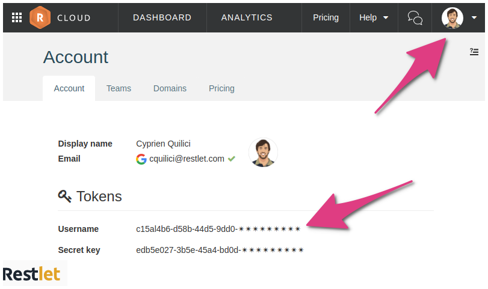

# Introduction

The Introspector's purpose is to extract the API contract from your Restlet Framework or JAX-RS code so that you can
document it or add gateway capabilities - like authorization and firewall - thanks to
<a href="https://cloud.restlet.com/" target="_blank">
Restlet Cloud <i class="fa fa-external-link" aria-hidden="true"></i>
</a>.

The Connector is the name of the component in Restlet Cloud which can act as a gateway in front of your API.

Let's discover how to use the Introspector tool! You can find all the source code for this documentation in
<a href="https://github.com/restlet/tutorials-resources/tree/master/introspector" target="_blank">
our tutorials <i class="fa fa-external-link" aria-hidden="true"></i>
</a>.

This tutorial uses Maven, so please make sure you have it installed before you proceed. You can install Maven
<a href="https://maven.apache.org/download.cgi" target="_blank">
here <i class="fa fa-external-link" aria-hidden="true"></i>
</a>.

<!-- TOC: BEGIN -->
* [Connect to Restlet Cloud](#connect-to-restlet-cloud)
* [Introspect a Restlet Framework API](#introspect-a-restlet-framework-api)
* [Introspect a JAXRS API](#introspect-a-jaxrs-api)
* [Update your existing connector](#update-your-existing-connector)
  * [Update an existing version](#update-an-existing-version)
  * [Create a new version](#create-a-new-version)
* [More information about the tool](#more-information-about-the-tool)
<!-- TOC: END -->

## Connect to Restlet Cloud

First of all, make sure you have a Restlet account and Restlet Cloud credentials. To do so, head to
<a href="https://cloud.restlet.com" target="_blank">
Restlet Cloud <i class="fa fa-external-link" aria-hidden="true"></i>
</a> and create an account.

Then find your credentials in the `Account` page, accessible from the top-right drop-down menu.

<!-- IN SCREENSHOT: TODO -->

## Introspect a Restlet Framework API

You can find a working example of the introspection described below
<a href="https://github.com/restlet/tutorials-resources/tree/master/introspector" target="_blank">
here <i class="fa fa-external-link" aria-hidden="true"></i>
</a>.

To get started, add the following parts to your API's pom.xml file:

<pre class="language-xml">
  <code class="language-xml">
&lt;repositories&gt;
    &lt;!-- Restlet's maven repository to fetch the Introspector --&gt;
    &lt;repository&gt;
        &lt;id&gt;maven-restlet&lt;/id&gt;
        &lt;name&gt;Restlet repository&lt;/name&gt;
        &lt;url&gt;https://maven.restlet.com&lt;/url&gt;
    &lt;/repository&gt;
&lt;/repositories&gt;

&lt;properties&gt;
    &lt;!-- The version of restlet framework you'll use --&gt;
    &lt;restlet.version&gt;2.4-M2&lt;/restlet.version&gt;
&lt;/properties&gt;

&lt;dependencies&gt;
    &lt;!-- The Introspector dependencies --&gt;
    &lt;dependency&gt;
        &lt;groupId&gt;org.restlet.jse&lt;/groupId&gt;
        &lt;artifactId&gt;org.restlet&lt;/artifactId&gt;
        &lt;version&gt;${restlet.version}&lt;/version&gt;
    &lt;/dependency&gt;
    &lt;dependency&gt;
        &lt;groupId&gt;org.restlet.jse&lt;/groupId&gt;
        &lt;artifactId&gt;org.restlet.ext.platform&lt;/artifactId&gt;
        &lt;version&gt;${restlet.version}&lt;/version&gt;
        &lt;exclusions&gt;
            &lt;exclusion&gt;
                &lt;groupId&gt;org.raml&lt;/groupId&gt;
                &lt;artifactId&gt;raml-parser&lt;/artifactId&gt;
            &lt;/exclusion&gt;
        &lt;/exclusions&gt;
    &lt;/dependency&gt;
    &lt;dependency&gt;
        &lt;groupId&gt;org.restlet.jse&lt;/groupId&gt;
        &lt;artifactId&gt;org.restlet.ext.jackson&lt;/artifactId&gt;
        &lt;version&gt;${restlet.version}&lt;/version&gt;
    &lt;/dependency&gt;
&lt;/dependencies&gt;

&lt;build&gt;
    &lt;plugins&gt;
        &lt;!-- This will help you generate an executable jar to run the Introspector --&gt;
        &lt;!-- You can omit it and run the Introspector in your IDE if it's more convenient a process to you --&gt;
        &lt;plugin&gt;
            &lt;groupId&gt;org.apache.maven.plugins&lt;/groupId&gt;
            &lt;artifactId&gt;maven-assembly-plugin&lt;/artifactId&gt;
            &lt;version&gt;3.1.0&lt;/version&gt;
            &lt;configuration&gt;
                &lt;descriptorRefs&gt;
                    &lt;descriptorRef&gt;jar-with-dependencies&lt;/descriptorRef&gt;
                &lt;/descriptorRefs&gt;
                &lt;archive&gt;
                    &lt;manifest&gt;
                        &lt;mainClass&gt;org.restlet.ext.platform.Introspector&lt;/mainClass&gt;
                    &lt;/manifest&gt;
                &lt;/archive&gt;
            &lt;/configuration&gt;
            &lt;executions&gt;
                &lt;execution&gt;
                    &lt;phase&gt;package&lt;/phase&gt;
                    &lt;goals&gt;
                        &lt;goal&gt;single&lt;/goal&gt;
                    &lt;/goals&gt;
                &lt;/execution&gt;
            &lt;/executions&gt;
        &lt;/plugin&gt;
    &lt;/plugins&gt;
&lt;/build&gt;
  </code>
</pre>

Once you have added this code to your API's pom.xml file, you can generate an executable jar by running `mvn clean install`.

The jar will be created in the `target` folder and will be named
`<your API name>-<your API version>-jar-with-dependencies.jar`.

You can now run the Introspector with the command: `java -jar target/<jar name>`. You can test that it works by running
`java -jar target/<jar name> --help`.

> Note: you can run the Introspector in your IDE if your prefer it, no need for an executable jar in this case.

Now that the Introspector is ready to run, make sure you've got your credentials - or get them by
[following these steps](#connect-to-restlet-cloud).

Once you're ready, create your first Connector by pointing the Introspector to the class in your code that extends
`org.restlet.Application`.

<pre class="language-shell">
  <code class="language-shell">
java -jar &lt;jar name&gt; --create-connector \
      --user &lt;username&gt; --password &lt;password&gt; \
      com.restlet.tutorials.MyApp
  </code>
</pre>

The Introspector will display a link to your newly created Connector and you can just follow it to display it.

<pre class="language-shell">
  <code class="language-shell">
Your Web API connector's id is: 123456
Your Web API documentation is accessible at this URL: https://cloud.restlet.com/apis/123456/versions/1/overview
  </code>
</pre>

From the Connector UI in Restlet Cloud, you'll be able to enhance your API by adding authentication, authorization,
rate limits, analytics, and more. For more detailed instructions, please navigate to
<a href="https://restlet.com/documentation/cloud/user-guide/manage/connectors" target="_blank">
the Connector user guide <i class="fa fa-external-link" aria-hidden="true"></i>
</a>.

> Note: if your API changes, you can update the Connector with the parameter `--update` or create a new version with
the parameter `--new-version`. More information on the full list of parameters with `--help`.

## Introspect a JAXRS API

Introspecting a JAX-RS API is just as simple as a Restlet Framework API, you just have to provide the fully-qualified
name of the class that extends `javax.ws.rs.core.Application` instead.

Just follow the [Restlet Framework tutorial](#introspect-a-restlet-framework-api), it works the same!

If you don't have a class that extends `javax.ws.rs.core.Application` in your code, you can provide a comma-separated
list of the classes that contain your resources as follows:

<pre class="language-shell">
  <code class="language-shell">
java -jar &lt;jar name&gt; --create-connector --jaxrs-resources com.example.MyResource,com.example.MyResource2
  </code>
</pre>

## Update your existing connector

If your API has changed or you released another version, you'll probably want to update the Connector to reflect the
changes. To do so, just re-use the Introspector tool!

### Update an existing version

To update an existing version of your Connector, run the following command:

<pre class="language-shell">
  <code class="language-shell">
java -jar &lt;the executable jar&gt; --update \
    --id &lt;connector id&gt; --version &lt;connector version&gt; &lt;class name&gt;
  </code>
</pre>

You can get the Connector ID and version in the URL of your browser when opening your connector. The URL will look
like this: `https://cloud.restlet.com/apis/<id>/versions/<version>/overview`.

You can decide to update your Connector - which is the default behavior. In this case, new items - models,
resources - will be added in your connector, existing items will be updated with the new version and nothing will get
deleted.

If you simply want to replace the version with the content from that new introspection, just add the parameter
`--update-strategy replace` to the command line.

### Create a new version

Restlet Cloud allows you to have multiple versions of the same Connector to maintain them all. To create a new version
of your Connector, just run the Introspector tool like this:

<pre class="language-shell">
  <code class="language-shell">
java -jar &lt;the executable jar&gt; --new-version \
    --id &lt;connector id&gt; &lt;class name&gt;
  </code>
</pre>

## More information about the tool

You will get more information about the tool by running it with the parameter `--help`. 

[Back to top](#introduction)
