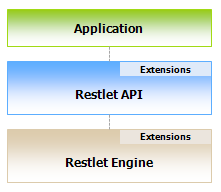
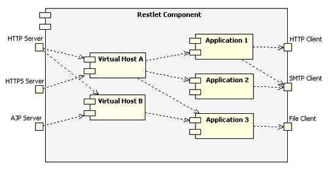
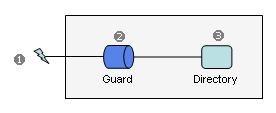
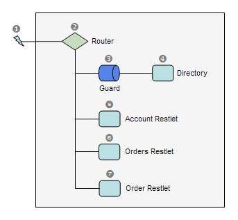
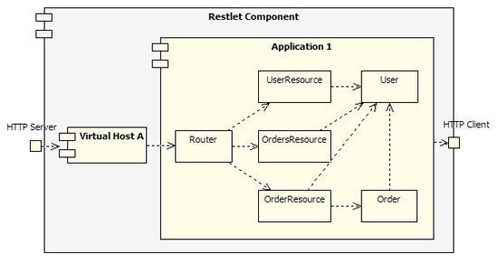
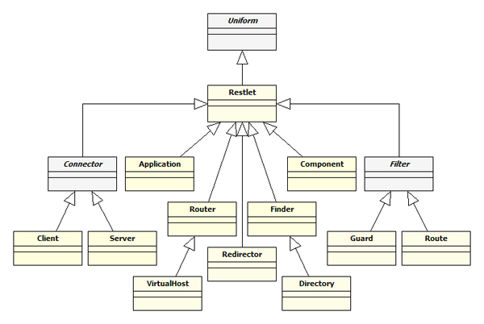

# Restlet 2.3 - Tutorial

## <a name="toc">Table of contents</a>

1.  [Restlet overview](#part01)
2.  [Retrieving the content of a Web page](#part02)
3.  [Listening to Web browsers](#part03)
4.  [Overview of a REST architecture](#part04)
5.  [Components, virtual hosts and applications](#part05)
6.  [Serving static files](#part06)
7.  [Access logging](#part07)
8.  [Displaying error pages](#part08)
9.  [Guarding access to sensitive resources](#part09)
10. [URI rewriting, attribute extraction and redirection](#part10)
11. [Routers and hierarchical URIs](#part11)
12. [Reaching target Resources](#part12)
13. [Conclusion](#conclusion)

## <a name="part01">1. Restlet overview</a>

The Restlet framework is composed of two main parts. First, there is the
"[Restlet API](/learn/javadocs/2.3/jse/api/)", a neutral API supporting
the concepts of REST and facilitating the handling of calls for both
client-side and server-side applications. This API is backed by the
Restlet Engine and both are now shipped in a single JAR
("org.restlet.jar").

This separation between the API and the implementation is similar to the
one between the Servlet API and Web containers like Jetty or Tomcat, or
between the JDBC API and concrete JDBC drivers.

## <a name="part02">2. Retrieving the content of a Web page</a>

As we mentioned in the [introduction
paper](/technical-resources/restlet-framework/guide/2.3/introduction/overview), the Restlet framework is at the
same time a client and a server framework. For example, Restlet can
easily work with remote resources using its HTTP client connector. A
connector in REST is a software element that enables the communication
between components, typically by implementing one side of a network
protocol. Restlet provides several implementations of client connectors
based on existing open-source projects. The
[connectors](/technical-resources/restlet-framework/guide/2.3/core/base/connectors) section lists all
available client and server connectors and explain how to use and
configure them.

Here we will get the representation of an existing resource and output
it in the JVM console:

~~~~ {.java:nocontrols:nogutter}
// Outputting the content of a Web page
new ClientResource("http://restlet.com").get().write(System.out);

~~~~

Note that the example above uses a simplified way to issue calls via the
ClientResource class. If you need multi-threading or more control it is
still possible to manipulate use the Client connector class or the
Request objects directly. The example below how to set some preferences
in your client call, like a referrer URI. It could also be the languages
and media types you prefer to receive as a response:

~~~~ {.java:nocontrols:nogutter}
// Create the client resource
ClientResource resource = new ClientResource("http://restlet.com");

// Customize the referrer property
resource.setReferrerRef("http://www.mysite.org");

// Write the response entity on the console
resource.get().write(System.out);

~~~~

## <a name="part03">3. Listening to Web browsers</a>

Now, we want to see how the Restlet framework can listen to client
requests and reply to them. We will use the internal Restlet HTTP server
connector (even though it is possible to switch to others such as the
one based on Mortbay's Jetty) and return a simple string representation
"hello, world" as plain text. Note that the Part03 class extends the
base ServerResource class provided by Restlet:

~~~~ {.java:nocontrols:nogutter}
public class Part03 extends ServerResource {

    public static void main(String[] args) throws Exception {
        // Create the HTTP server and listen on port 8182
        new Server(Protocol.HTTP, 8182, Part03.class).start();
    }

    @Get("txt")
    public String toString() {
        return "hello, world";
    }

}

~~~~

If you run this code and launch your server, you can open a Web browser
and hit the <http://localhost:8182>. Actually, any URI will work, try
also <http://localhost:8182/test/tutorial>. Note that if you test your
server from a different machine, you need to replace "localhost" by
either the IP address of your server or its domain name if it has one
defined.

So far, we have mostly showed you the highest level of abstraction in
the Restlet API, with the ClientResource and ServerResource classes. But
as we move forward, you will discover that those two classes are
supported by a rich API, letting you manipulate all the REST artifacts.

## <a name="part04">4. Overview of a REST architecture</a>

Let's step back a little and consider typical web architectures from a
REST point of view. In the diagram below, ports represent the connector
that enables the communication between components which are represented
by the larger boxes. The links represents the particular protocol (HTTP,
SMTP, etc.) used for the actual communication.

Note that the same component can have any number of client and server
connectors attached to it. Web Server B, for example, has both a server
connector to respond to requests from the User Agent component, and
client connectors to send requests to Web Server A and the Mail Server.

## <a name="part05">5. Components, virtual hosts and applications</a>

In addition to supporting the standard REST software architecture
elements as presented before, the Restlet framework also provides a set
of classes that greatly simplify the hosting of multiple applications
within a single JVM. The goal is to provide a RESTful, portable and more
flexible alternative to the existing Servlet API. In the diagram below,
we can see the three types of Restlets that are provided in order to
manage these complex cases. Components can manage several Virtual Hosts
and Applications.

Virtual Hosts support flexible configuration where, for example, the
same IP address is shared by several domain names, or where the same
domain name is load-balanced across several IP addresses. Finally, we
use Applications to manage a set of related Restlets, Resources and
Representations. In addition, Applications are ensured to be portable
and reconfigurable over different Restlet implementations and with
different virtual hosts. In addition, they provide important services
like access logging, automatic decoding of request entities,
configurable status page setting and more!

In order to illustrate these classes, let's examine a simple example.
Here we create a Component, then add an HTTP server connector to it,
listening on port 8182. Then we create a simple trace Restlet and attach
it to the defaut VirtualHost of the Component. This default host is
catching any request that wasn't already routed to a declared
VirtualHost (see the Component.hosts property for details). In a later
example, we will also introduce the usage of the Application class. Note
that for now you don't see any access log displayed in the console.

~~~~ {.java:nocontrols:nogutter}
public static void main(String[] args) throws Exception {
    // Create a new Restlet component and add a HTTP server connector to it
    Component component = new Component();
    component.getServers().add(Protocol.HTTP, 8182);

    // Then attach it to the local host
    component.getDefaultHost().attach("/trace", Part05.class);

    // Now, let's start the component!
    // Note that the HTTP server connector is also automatically started.
    component.start();
}

@Get("txt")
public String toString() {
    // Print the requested URI path
    return "Resource URI  : " + getReference() + '\n' + "Root URI      : "
            + getRootRef() + '\n' + "Routed part   : "
            + getReference().getBaseRef() + '\n' + "Remaining part: "
            + getReference().getRemainingPart();
}

~~~~

Now let's test it by entering
<http://localhost:8182/trace/abc/def?param=123> in a Web browser. Here
is the result that you will get:

    Resource URI  : http://localhost:8182/trace/abc/def?param=123
    Root URI      : http://localhost:8182/trace
    Routed part   : http://localhost:8182/trace
    Remaining part: /abc/def?param=123

## <a name="part06">6. Serving static files</a>

Do you have a part of your web application that serves static pages like
Javadocs? Well, no need to setup an Apache server just for that, use
instead the dedicated Directory class. See how simple it is to use it:

~~~~ {.java:nocontrols:nogutter}
// URI of the root directory.
public static final String ROOT_URI = "file:///c:/restlet/docs/api/";

[...]

// Create a component
Component component = new Component();
component.getServers().add(Protocol.HTTP, 8182);
component.getClients().add(Protocol.FILE);

// Create an application
Application application = new Application() {
    @Override
    public Restlet createInboundRoot() {
            return new Directory(getContext(), ROOT_URI);
    }
};

// Attach the application to the component and start it
component.getDefaultHost().attach(application);
component.start();

~~~~

In order to run this example, you need to specify a valid value for
ROOT\_URI, In this case, it is set to "file:///c:/restlet/docs/api/".
Note that no additional configuration is needed. If you want to
customize the mapping between file extensions and metadata (media type,
language or encoding) or if you want to specify a different index name,
you can use the Application's
["metadataService"](/learn/javadocs/2.3/jse/api/org/restlet/service/MetadataService.html)
property.

## <a name="part07">7. Access logging</a>

Being able to properly log the activity of a Web application is a common
requirement. Restlet Components know by default how to generate
Apache-like logs or even custom ones. By taking advantage of the logging
facility built in the JDK, the logger can be configured like any
standard JDK log to filter messages, reformat them or specify where to
send them. Rotation of logs is also supported; see the
[java.util.logging](https://docs.oracle.com/javase/6/docs/api/java/util/logging/package-summary.html)
package for details.

Note that you can customize the logger name given to the
java.util.logging framework by modifying the Component's "logService"
property. In order to fully configure the logging, you need to declare a
configuration file by setting a system property like:

~~~~ {.java:nocontrols:nogutter}
System.setProperty("java.util.logging.config.file",
        "/your/path/logging.config");

~~~~

For details on the configuration file format, please check the [JDK's
LogManager](https://docs.oracle.com/javase/6/docs/api/java/util/logging/LogManager.html)
class.

You can also have a look at the [Restlet 2.3 logging
documentation](/learn/guide/2.3/editions/jse/logging).

## <a name="part08">8. Displaying error pages</a>

Another common requirement is the ability to customize the status pages
returned when something didn't go as expected during the call handling.
Maybe a resource was not found or an acceptable representation isn't
available? In this case, or when any unhandled exception is be
intercepted, the Application or the Component will automatically provide
a default status page for you. This service is associated to the
org.restlet.util.StatusService class, which is accessible as an
Application and Component property called "statusService".

In order to customize the default messages, you will simply need to
create a subclass of StatusService and override the
getRepresentation(Status, Request, Response) method. Then just set an
instance of your custom service to the appropriate "statusService"
property.

## <a name="part09">9. Guarding access to sensitive resources</a>

When you need to secure the access to some Restlets, several options are
available. A common way is to rely on cookies to identify clients (or
client sessions) and to check a given user ID or session ID against your
application state to determine if access should be granted. Restlets
natively support cookies via the
[Cookie](/learn/javadocs/2.3/jse/api/org/restlet/data/Cookie.html) and
[CookieSetting](/learn/javadocs/2.3/jse/api/org/restlet/data/CookieSetting.html)
objects accessible from a
[Request](/learn/javadocs/2.3/jse/api/org/restlet/Request.html) or a
[Response](/learn/javadocs/2.3/jse/api/org/restlet/Response.html).

There is another way based on the standard HTTP authentication
mechanism. The Restlet Engine currently accepts credentials sent and
received in the Basic HTTP scheme and also the credentials sent in the
Amazon Web Services scheme.

When receiving a call, developers can use the parsed credentials
available in Request.challengeResponse.identifier/secret via the
ChallengeAuthenticator filter. Filters are specialized Restlets that can
pre-process a call before invoking and attached Restlet or post-process
a call after the attached Restlet returns it. If you are familiar with
the Servlet API, the concept is similar to the
[Filter](http://docs.oracle.com/javaee/7/api/javax/servlet/Filter.html)
interface. See below how we would modify the previous example to secure
the access to the Directory:

~~~~ {.java:nocontrols:nogutter}
// Create a simple password verifier
MapVerifier verifier = new MapVerifier();
verifier.getLocalSecrets().put("scott", "tiger".toCharArray());

// Create a Guard
ChallengeAuthenticator guard = new ChallengeAuthenticator(
                getContext(), ChallengeScheme.HTTP_BASIC, "Tutorial");
guard.setVerifier(verifier);

// Create a Directory able to return a deep hierarchy of files
Directory directory = new Directory(getContext(), ROOT_URI);
directory.setListingAllowed(true);
guard.setNext(directory);

return guard;

~~~~

Note that the authentication and authorization decisions are clearly
considered as distinct concerns and are fully customizable via dedicated
filters that inherit from the Authenticator (such as
ChallengeAuthenticator) and the Authorizer abstract classes. Here we
simply hard-coded a single user and password couple. In order to test,
let's use the client-side Restlet API:

~~~~ {.java:nocontrols:nogutter}
// Prepare the request
ClientResource resource = new ClientResource("http://localhost:8182/");

// Add the client authentication to the call
ChallengeScheme scheme = ChallengeScheme.HTTP_BASIC;
ChallengeResponse authentication = new ChallengeResponse(scheme,
        "scott", "tiger");
resource.setChallengeResponse(authentication);

// Send the HTTP GET request
resource.get();

if (resource.getStatus().isSuccess()) {
    // Output the response entity on the JVM console
    resource.getResponseEntity().write(System.out);
} else if (resource.getStatus()
        .equals(Status.CLIENT_ERROR_UNAUTHORIZED)) {
    // Unauthorized access
    System.out
            .println("Access unauthorized by the server, check your credentials");
} else {
    // Unexpected status
    System.out.println("An unexpected status was returned: "
            + resource.getStatus());
}

~~~~

You can change the user ID or password sent by this test client in order
to check the response returned by the server. Remember to launch the
previous Restlet server before starting your client. Note that if you
test your server from a different machine, you need to replace
"localhost" by either the IP address of your server or its domain name
when typing the URI in the browser. The server won't need any adjustment
due to the usage of a VirtualHost which accepts all types of URIs by
default.

## <a name="part10">10. URI rewriting and redirection</a>

Another advantage of the Restlet framework is the built-in support for
[cool URIs](http://www.w3.org/Provider/Style/URI). A good description of
the importance of proper URI design is given by Jacob Nielsen in his
[AlertBox](http://www.useit.com/alertbox/990321.html).

The first tool available is the Redirector, which allows the rewriting
of a cool URI to another URI, followed by an automatic redirection.
Several types of redirection are supported, the external redirection via
the client/browser and the connector redirection for proxy-like
behavior. In the example below, we will define a search service for our
web site (named "mysite.org") based on Google. The "/search" relative
URI identifies the search service, accepting some keywords via the "kwd"
parameter:

~~~~ {.java:nocontrols:nogutter}
// Create a root router
Router router = new Router(getContext());

// Create a Redirector to Google search service
String target = "http://www.google.com/search?q=site:mysite.org+{keywords}";
Redirector redirector = new Redirector(getContext(), target,
        Redirector.MODE_CLIENT_TEMPORARY);

// While routing requests to the redirector, extract the "kwd" query
// parameter. For instance :
// http://localhost:8182/search?kwd=myKeyword1+myKeyword2
// will be routed to
// http://www.google.com/search?q=site:mysite.org+myKeyword1%20myKeyword2
Extractor extractor = new Extractor(getContext(), redirector);
extractor.extractQuery("keywords", "kwd", true);

// Attach the extractor to the router
router.attach("/search", extractor);

~~~~

Note that the Redirector needs three parameters only. The first is the
parent context, the second one defines how the URI rewriting should be
done, based on a URI template. This template will be processed by the
[Template](/learn/javadocs/2.3/jse/api/org/restlet/routing/Template.html)
class. The third parameter defines the type of redirection; here we
chose the client redirection, for simplicity purpose.

Also, we are relying on the Route class to extract the query parameter
"kwd" from the initial request while the call is routed to the
application. If the parameter is found, it is copied into the request
attribute named "keywords", ready to be used by the Redirector when
formatting its target URIs.

## <a name="part11">11. Routers and hierarchical URIs</a>

In addition to the Redirector, we have another tool to manage cool URIs:
Routers. They are specialized Restlets that can have other Restlets
(Finders and Filters for example) attached to them and that can
automatically delegate calls based on a [URI
template](http://bitworking.org/projects/URI-Templates/). In general,
you will set a Router as the root of your Application.

Here we want to explain how to handle the following URI patterns:

1.  /docs/ to display static files
2.  /users/{user} to display a user account
3.  /users/{user}/orders to display the orders of a particular user
4.  /users/{user}/orders/{order} to display a specific order

The fact that these URIs contain variable parts (between accolades) and
that no file extension is used makes it harder to handle them in a
typical Web container. Here, you just need to attach target Restlets to
a Router using the URI template. At runtime, the route that best matches
the request URI will received the call and be able to invoke its
attached Restlet. At the same time, the request's attributes map will be
automatically updated with the value of the URI template variables!

See the implementation code below. In a real application, you will
probably want to create separate subclasses instead of the anonymous
ones we use here:

~~~~ {.java:nocontrols:nogutter}
// Create a root router
Router router = new Router(getContext());

// Attach a guard to secure access to the directory
Guard guard = new Guard(getContext(), ChallengeScheme.HTTP_BASIC,
        "Restlet tutorial");
guard.getSecrets().put("scott", "tiger".toCharArray());
router.attach("/docs/", guard);

// Create a directory able to expose a hierarchy of files
Directory directory = new Directory(getContext(), ROOT_URI);
guard.setNext(directory);

// Create the account handler
Restlet account = new Restlet() {
    @Override
    public void handle(Request request, Response response) {
        // Print the requested URI path
        String message = "Account of user \""
                + request.getAttributes().get("user") + "\"";
        response.setEntity(message, MediaType.TEXT_PLAIN);
    }
};

// Create the orders handler
Restlet orders = new Restlet(getContext()) {
    @Override
    public void handle(Request request, Response response) {
        // Print the user name of the requested orders
        String message = "Orders of user \""
                + request.getAttributes().get("user") + "\"";
        response.setEntity(message, MediaType.TEXT_PLAIN);
    }
};

// Create the order handler
Restlet order = new Restlet(getContext()) {
    @Override
    public void handle(Request request, Response response) {
        // Print the user name of the requested orders
        String message = "Order \""
                + request.getAttributes().get("order")
                + "\" for user \""
                + request.getAttributes().get("user") + "\"";
        response.setEntity(message, MediaType.TEXT_PLAIN);
    }
};

// Attach the handlers to the root router
router.attach("/users/{user}", account);
router.attach("/users/{user}/orders", orders);
router.attach("/users/{user}/orders/{order}", order);

~~~~

Note that the routing assumes that your request contains an absolute
target URI that identifies a target resource. During the request
processing the resource's base URI is continuously updated, for each
level in the hierarchy of routers. This explains why the default
behavior of routers is to match only the beginning of the remaining URI
part and not the totality of it. In some cases, you might want to change
this default mode, and this is easy to do via the "defaultMatchingMode"
property on Router, or by modifying the "matchingMode" property of the
template associated with the route created by the Router.attach()
methods. For the modes, you can use the Template.MODE\_EQUALS or
Template.MODE\_STARTS\_WITH constants.

Please note that the values of the variables are directly extracted from
the URI and are therefore not percent-decoded. In order to achieve such
a task, have a look to the
[Reference\#decode(String)](/learn/javadocs/2.3/jse/api/org/restlet/data/Reference.html#decode(java.lang.String) "Reference#decode(String)")
method.

## <a name="part12">12. Reaching target Resources</a>

In the previous example, we took advantage of the flexible routing
features of the framework to route the requests while extracting
interesting parts from the target URI. But, we didn't pay attention to
the request method, nor to the client preferences regarding the response
that he expects. Also, how do we connect our Restlet resources with the
backend systems, the domain objects?

So far, we introduced features that go beyond the traditional Servlet
API and introduced our support for REST that justify our Restlet name!
If haven't done so already, you can learn more about the REST
architecture style and the best practices to follow when applying it to
a Web application. There is a related [FAQ entry](/technical-resources/restlet-framework/guide/2.3/appendices/faq#how-to-use-restlet-in-an-applet) that
will give you some starting pointers. If you have some experience with a
traditional MVC framework, you can read more about the relationship to
Restlet in this other [FAQ
entry](/technical-resources/restlet-framework/guide/2.3/appendices/faq#how-do-i-implement-the-traditional-mvc-pattern).

To summarize, a request contains an URI that identifies the target
resource that is the subject of the call. This information is stored in
the Request.resourceRef property and serves as the basis of the routing
as we saw. So the first goal when handling a request is to find the
target resource which is in the framework... an instance of the
ServerResource class or more precisely one of its subclasses. To help us
in this task, we can use the dedicated Finder, a subclass of Restlet,
which takes a ServerResource class reference as an argument and which
will automatically instantiate it when a request comes in. The resource
will dynamically dispatch the call to either a matching annotated method
or to a predefined method (get(), post(), put(), delete(), etc.). Of
course, this behavior can be customized. There is even an attach()
method on Router that can take two arguments, an URI template and a
ServerResource class and that transparently creates the Finder for you.
Now, let's have a look at this overall diagram, showing the relationship
between the main framework classes involved in this example:

Back to the code, here is our refactored Application.createRoot()
method. For simplicity purpose, we didn't keep the Directory serving
static files as this part wouldn't change. You can notice the way that
resource classes are directly attached to the router.

~~~~ {.java:nocontrols:nogutter}
// Create a router
Router router = new Router(getContext());

// Attach the resources to the router
router.attach("/users/{user}", UserResource.class);
router.attach("/users/{user}/orders", OrdersResource.class);
router.attach("/users/{user}/orders/{order}", OrderResource.class);

~~~~

We will finally review one of the resource classes, the UserResource
class. This class derives from org.restlet.resource.ServerResource. We
override the doInit() method to retrieve the attribute "user" that is
automatically extracted from the "/users/{user}" URI template and store
its value in a convenient member variable. At this point, in a full
application, we would lookup our associated "user" domain object.
Finally, we declare a toString() method that supports the GET method as
indicated by the @Get annotation.

~~~~ {.java:nocontrols:nogutter}
public class UserResource extends ServerResource {
    String userName;

    Object user;

    @Override
    public void doInit() {
        this.userName = getAttribute("user");
        this.user = null; // Could be a lookup to a domain object.
    }

    @Get("txt")
    public String toString() {
        return "Account of user \"" + this.userName + "\"";
    }
}

~~~~

You can have a look at the rest of the code in the tutorial package and
test the application. You will obtain the same behavior as in Part11,
with the difference that only GET requests will be accepted. If you want
to enable PUT for example, you have to create a Java method in
UserResource and annotate it with @Put. You can check the Javadocs for
further details.

## <a name="conclusion">Conclusion</a>

We have already covered many aspects of the framework. Before you move
on by yourself, let's take a step back and look at two hierarchy
diagrams showing the main concepts covered in this tutorial and their
relationships:

Now, here is the hierarchy with the core Representation classes:

Beside this tutorial, your best source of information will be the
Javadocs available for the [Restlet API](/technical-resources/restlet-framework/javadocs/2.3/jse/api/),
the [Restlet Extensions](/technical-resources/restlet-framework/javadocs/2.3/jse/ext/) and the [Restlet
engine](/technical-resources/restlet-framework/javadocs/2.3/jse/engine/). Have also a look at the
[connectors](/technical-resources/restlet-framework/guide/2.3/core/base/connectors) section that lists
all available client and server connectors and explain how to use and
configure them, and the
[integrations](/technical-resources/restlet-framework/guide/2.3/extensions/editions-matrix) section for
a list of all available extensions providing pluggable features such as
integration with servlet containers, generation of dynamic
representations, etc. You can also post your questions and help others
in our [discussion list](/community/lists).

### <a name="notes">Notes</a>

-   We encourage you to run the examples. The full source code is
    available in the latest release.
-   Thanks to [Jean-Paul Figer](http://www.figer.com/), Christian
    Jensen, Jim Ancona, Roger Menday, John D. Mitchell, Jérôme Bernard,
    Dave Pawson, Peter Murray, Alex Combs and Leonardo Maranhão for the
    feed-back on this tutorial.
