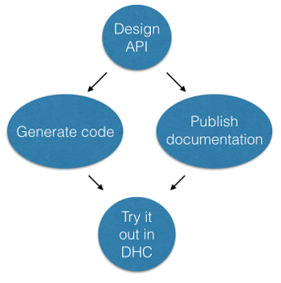

# What Restlet Studio does and for whom

Restlet Studio helps people working on two important stages of an API project: design and documentation. With an easy learning curve, even non-developers can **design an API** and **publish its documentation** with Restlet Studio. The documentation includes a button to **try in DHC** which lets you immediately interact with the API.

Thanks to its graphical user interface, Restlet Studio is also a favorite for people who want to **create Swagger or RAML API definitions**, without having to learn the complex syntax of these languages.

Restlet Studio also features powerful **code generation** capabilities for developers who want to save time on developing the API-layer of their server or client application.

# About APIs

APIs enable distributed software to communicate over a network by exchanging messages. REST is a popular style of APIs used today thanks to its simplicity and natural tendency to work well on the web.

In REST (or REST-like) APIs, servers and client applications exchange HTTP messages such as GET POST and DELETE. REST APIs are commonly used as interfaces between mobile or web applications and their backends.

Increasingly, APIs are being considered valuable products themselves. They allow organizations to extend the reach of their data and services beyond internal boundaries. This enables them to tap into the ever growing ecosystem of third party developers and partners, from which enormous wealth and creativity can be found.
