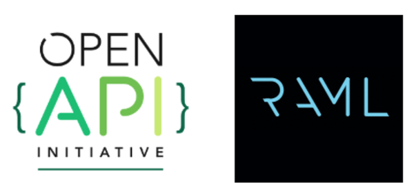
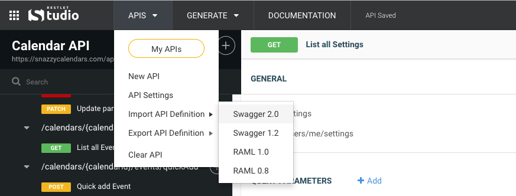

Do you have an existing API definition? Not a problem, Restlet Studio allows you to import the following formats:

- Swagger 2.0
- Swagger 1.2
- RAML 1.0
- RAML 0.8

You can either create a new API and then import your API definition, or import directly into your currently open API and chose to either replace it or merge.

The import action is located in the the **APIs** menu.

 

# I can't import my API definition, or some parts have been ignored

Restlet Studio will try its best to import all of your API definitions. If the definition it not conform to the corresponding OAI or RAML specification, then either the entire file will be rejected, or the invalid parts of the API will be ignored.

Please contact support via the in-app chat widget if you are having trouble importing your API definition, we're happy to help!
