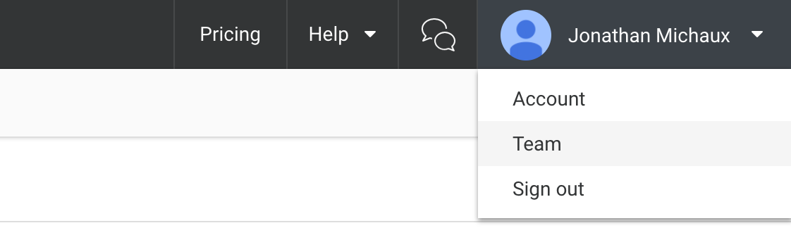
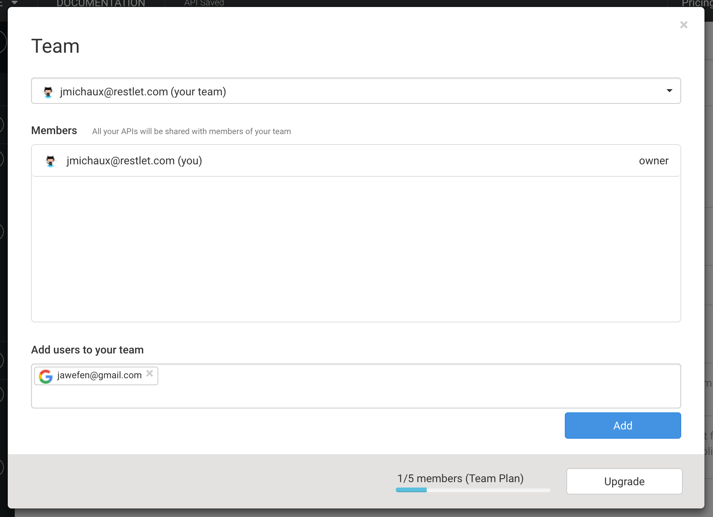
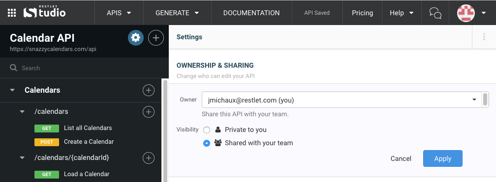

# Managing your team

As a Restlet user, you'll have one team assigned to your account. This team will be used across Restlet Studio, DHC, and APISpark.

To add people to your team, open the Team menu from the profile drop-down menu in the header bar.

In the Team panel, you can view the members of each of the teams that you belong to.

When your team is selected, you'll be able to add and remove members.

# Share an API with your team

In order to collaborate on an API with your team members, you'll need to change the API's visibility settings so that it is shared with your team.

To modify an API's team visibility, navigate to the API's general information panel (by clicking on the API's name in the upper left) and change the visibility to *Shared with my team*. The same setting can also be changed from the **My APIs** panel.

