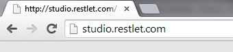
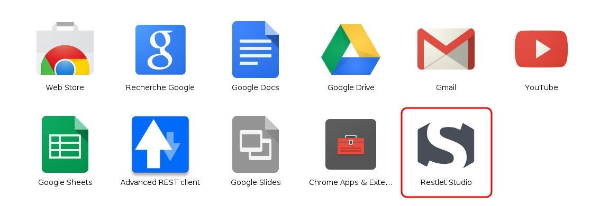
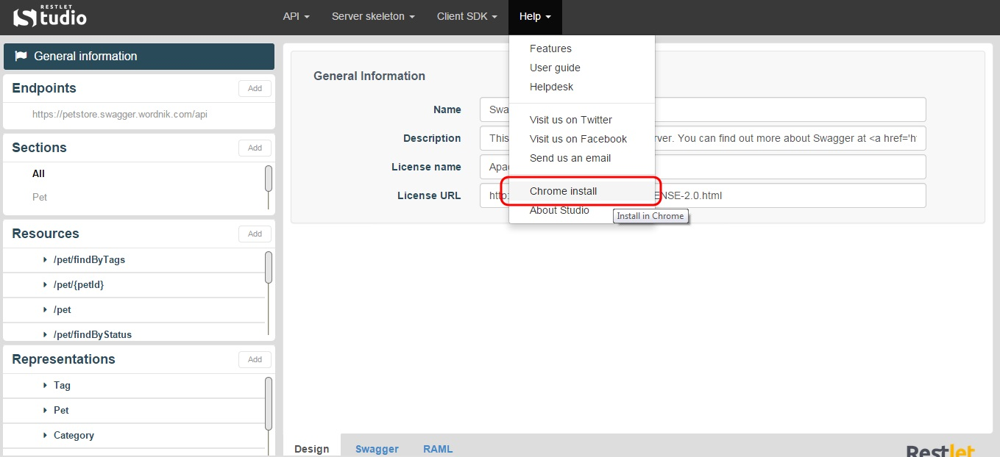

To craft your web APIs in Restlet Studio console, you do not need to sign in first.

You can launch Restlet Studio directly from a web browser or as a Google Chrome application without signing in.

# From a browser

Launch Restlet Studio from your web browser at the following address:  
`studio.restlet.com`

## as Google Chrome application

Restlet Studio has a special integration with Google Chrome.

## From Google Chrome

To launch Restlet Studio as a Chrome application:

Add **Restlet Studio** to your Google Chrome Applications library from <a href="https://chrome.google.com/webstore/detail/restlet-studio/pnphdpmegdolicoagnheljfgebpdgmfi?utm_source=gmail" target="_blank">Google Chrome Web Store</a>.  

Click on the **+ free** button and **Add** the application. Restlet Studio icon displays with your Google Chrome applications.

# From Restlet Studio

You can install Restlet Studio in Chrome directly from the Restlet Studio interface.

Click on the **Help** menu and select **Chrome install**.

You can also launch Restlet Studio from your [web browser](/technical-resources/restlet-studio/guide/get-started/web-browser "web browser") without signing in.
