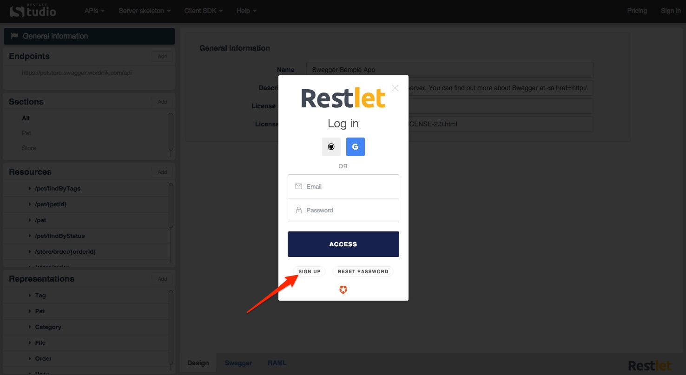

Restlet Studio's sign up process is straightforward. It relies on social login to make signing up as simple as possible for you.

To sign up, click on the **Sign in** button from the <a href="https://dhc.restlet.com/" target="_blank">Restlet Studio page</a> of our website and pick a social provider to identify yourself with. Your account will automatically be created for you.

# Sign in with your social provider account  

Several social login providers are supported, including **GitHub** and **Google**. You can create an account for free with these providers if you do not already own one.

If you are not already logged-in to your chosen provider, you will be asked to enter your username and password.

# Sign up with an email account

If you do not own an account at these social providers, you can simply sign up using any existing email address.

Click on the **Sign up** button.  
Enter your email address and password.  
Click on the **Sign up** button.

