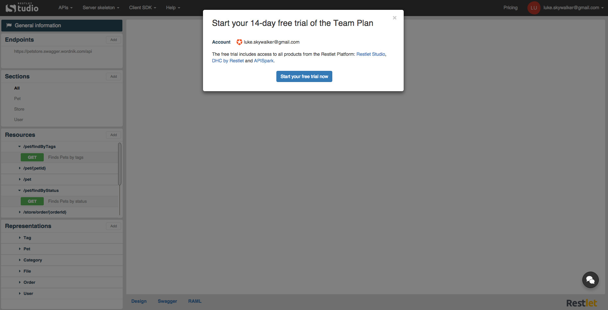

Restlet allows you to try Restlet Studio, DHC and APISpark for 14 days for free!

You will be assigned a Team Plan.

From the Restlet Studio, you will access the following features:

- Visual API contract design
- Swagger and RAML support
- Server skeleton generation
- Client SDK generation
- APIs saved to cloud
- Creation of up to 25 APIs
- Premium support
- Collaboration with up to 5 members

You can upgrade to a permanent Plan at any time. After 14 days, if you did not upgrade, you will be automatically assigned a Free Plan with limited features.

The **Plans & Pricing** page, accessible from the **Pricing** menu, indicates the number of days left in your free trial.

To start a Free Trial, click on **Pricing** on top right of your screen.
Click on **Start Free Trial**.

