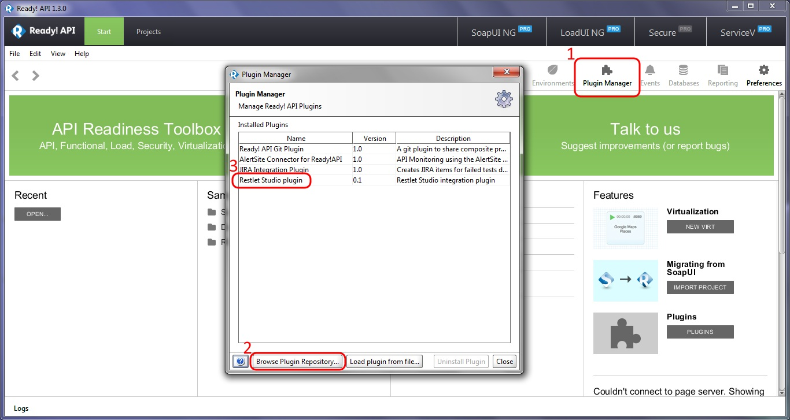
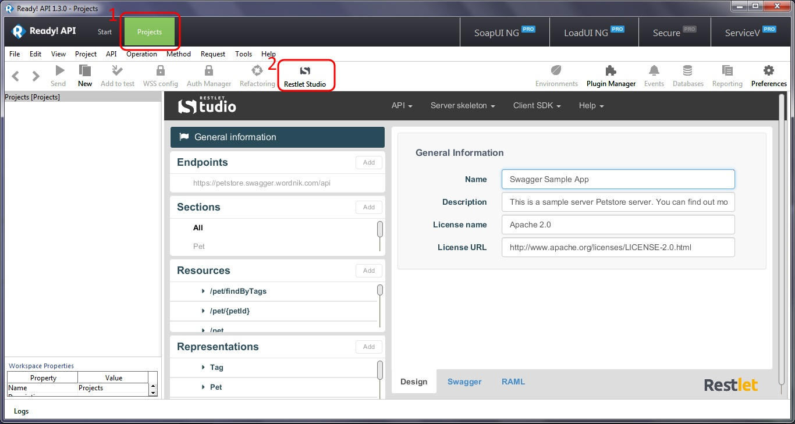

Restlet Studio has a special integration with <a href="http://smartbear.com/product/ready-api/overview/" target="_blank">Ready API!</a>.

# Install Restlet Studio plugin from Ready API!

From Ready API! overview, click on **Plugin Manager**.  
From the **Plugin Manager** window, click on the **Browse Plugin Repository** button and select **Restlet Studio plugin**.

>**Note:** You will need to restart Ready API! to allow Swagger and RAML definition calls to be performed properly.

# Launch Restlet Studio

Click on the **Projects** tab.  
From the toolbar, select **Restlet Studio**.

Find more on Restlet Studio in our [user guide](/technical-resources/restlet-studio/guide "Restlet Studio User Guide").
