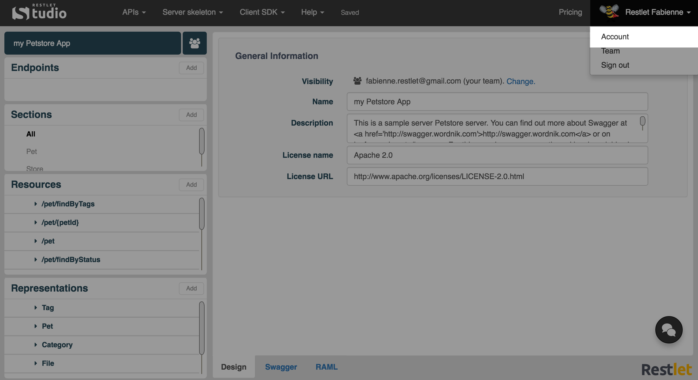
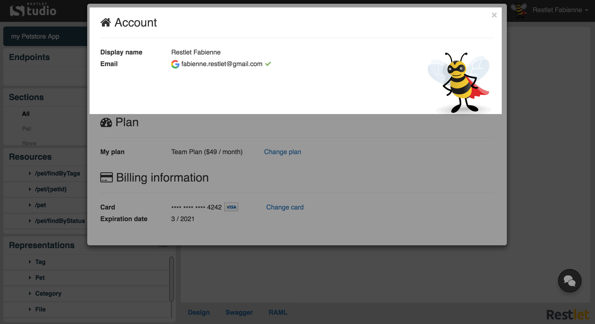
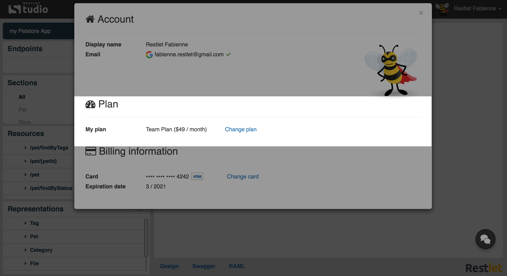
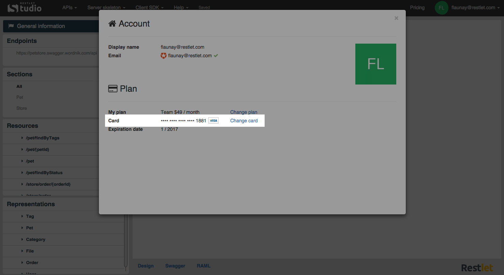

All your Restlet Studio account details are available on the **Account** page.

To navigate to your **Account** page, make sure you are signed in, then click on your username on top right of your screen and select **My account**.

Your **Account** page is divided into 2 sections:  

- the **Account** section provides your account details.  

- the **Plan** section provides information about the plan you selected and allows you to change plan or modify your billing details.

# Account

 * **Display name**: name that will display on top right of your screen.  
 * **Email**:
- logo of the social provider you used to sign in (or Auht0 logo if you signed in with your email address directly),
- your email address,
- a green tick if you confirmed your email address in the email that was sent automatically to your mailbox or a **Not verified** link if you did not,
 * your profile picture.

# Plan

## Description

 * **My plan**:
- name of plan / price per month,
- **Change plan** link.
 * **Card**:
- partially hidden credit card number and type of card,
- **Change card** link.
 * **Expiration date**: credit card expiration date in month/year format

## Change plan

You can downgrade or upgrade plan directly from your **Account** page.  
Click on the **Change plan** link.  
From the **Plans & Pricing** page, click on the appropriate **Downgrade** or **Upgrade** button and follow the confirmation messages.

## Change card

If you need to change the credit card you saved in your billing details, click on the **Change card** link and enter your new credit card details in the **Change credit card** window.
