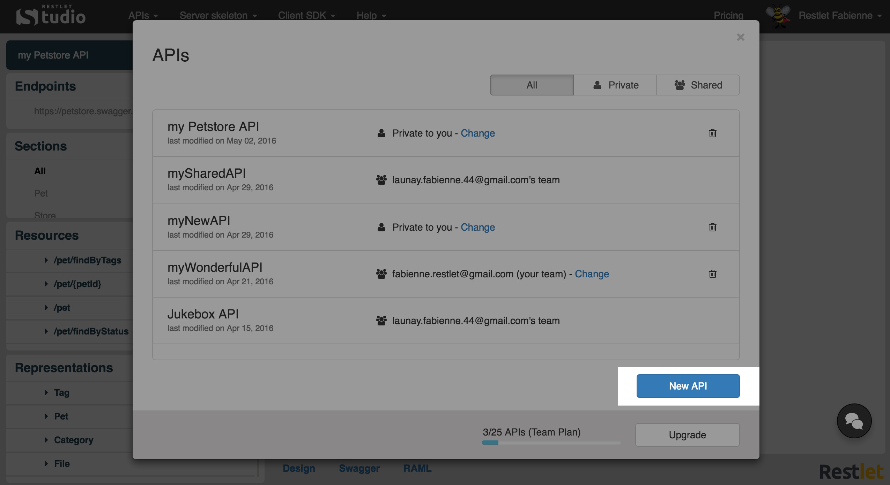
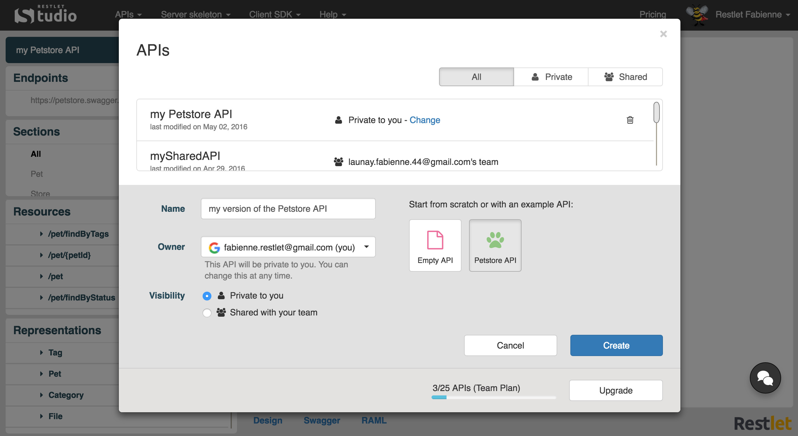
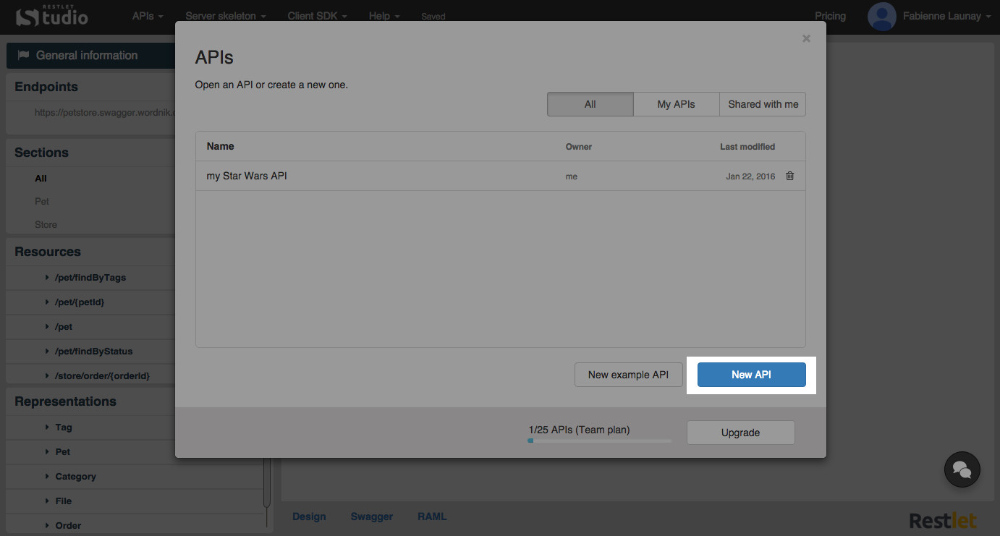

Restlet Studio allows you to craft your APIs from scratch from its design view. You can visually edit the [endpoints](/technical-resources/restlet-studio/guide/craft/endpoints "endpoints"), [resources](/technical-resources/restlet-studio/guide/craft/resources "resources"), methods and [representations](/technical-resources/restlet-studio/guide/craft/representations "representations") of your API. You can also classify your resources and representations by creating sections.

# Create a new API definition

## From a sample API

To create a new API definition, you can start from the sample API provided and change its characteristics in the **General Information** window and in the left panel.

Once you are logged in, click on the **APIs** menu and select **My APIs**.  
Click on the **New API** button.  

Enter a **Name** for your API, select its **Owner** (you by default) and its **Visibility** (private by default).  
Select an API example (the API is empty by default).  

Click **Create**.

## From scratch

If you would rather start from scratch, click on the **APIs** menu and select **Clear**.

From your **APIs** page, you can also click the **New API** button and select *Empty API*.

<!--
## Save and restore your API definition

To save the API definition you are designing, click the **API** menu and select **Save**. Your API definition is saved in your web browser local storage. You can now close your web browser.  
To restore the version you saved, open Restlet Studio in the same web browser, click the **API** menu and select **Restore**.  
You can thus work offline by restoring an API definition and saving it in your web browser local storage. Of course you will not be able to download SDKs and server skeletons offline.

>**Note:** Your web browser local storage is specific to each web browser. If you cannot find your API definition last version saved, check out your web browser preferences. In Google Chrome, press CTRL+MAJ+Suppr keys, and make sure the **Hosted app data** checkbox is not selected (it is not selected by default).

# Load an API definition sample

If you wish to see an API definition sample, Restlet Studio provides you one by clicking the **API** menu and selecting **Load sample**.
-->
