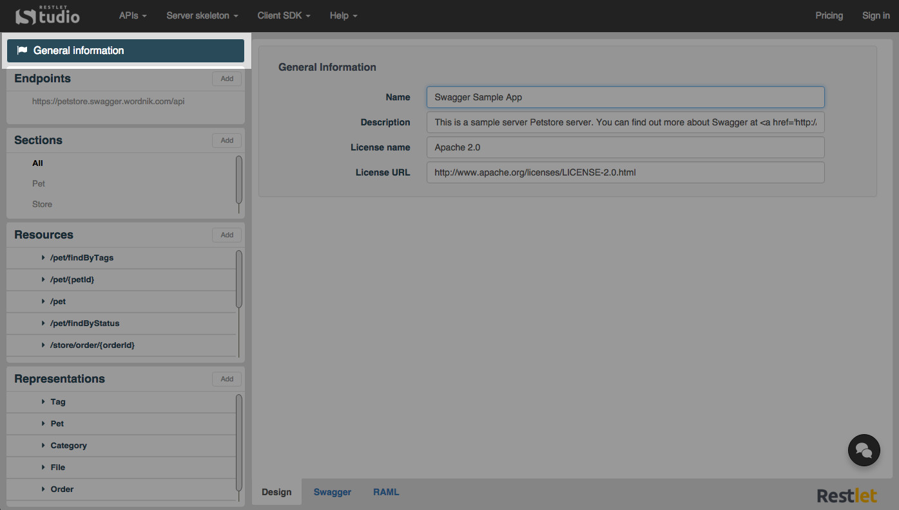

Restlet Studio also provides you with the API General information such as its **Owner**, its **Name**, **Description**, **License name** and **URL**.

To get your API General information, click on the API name on top of the left panel. The General information section displays in the main panel.

