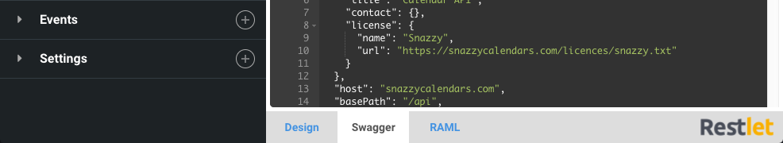
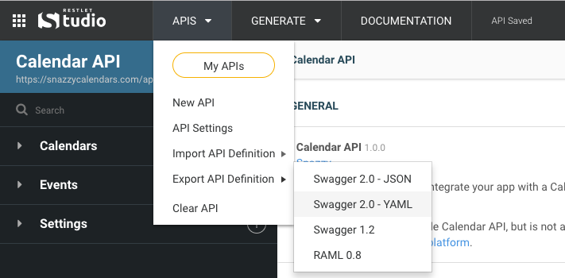

Restlet Studio is a popular choice for API designers who wish to create API definitions according to the OAS (formerly known as Swagger) and RAML specifications.

Restlet Studio's editor allows you to these specifications without know their complicated syntax. And from a single API design in Restlet Studio, you can export all types of API definitions.

# Preview your API definition as you go

The tabs at the bottom of the editor allow you to quickly preview your API design in Swagger or RAML as you go along.

# Export your finished API

When you've finished designing your API, you can download the Swagger or RAML directly to a file through the *Export API definition* entry in the *APIs* drop-down menu.

