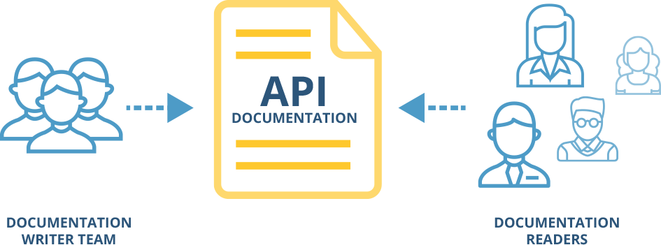

If you need to document your API, Restlet Studio has you covered.

Documentation is an important step in the lifecycle of an API. We all know how much trouble writing and maintaining documentation can be, so save yourself the hassle and get yours automatically with Restlet Studio.

# Who writes documentation and who reads it?

In Restlet Studio, you work in a team of API designers that are allowed to edit your API design. Your team members can contribute to the documentation of your API, and can publish it.

Published documentation can then be freely distributed to as many API consumers as you wish. These might be members of your team, partners, or anybody on the web.

png:

svg:

