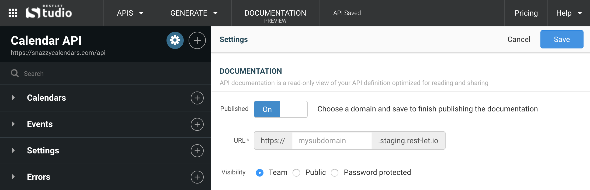

Until you publish your API documentation, it is only viewable as a preview. This is shown by the fact that it says *PREVIEW* in the header bar *DOCUMENTATION* button.

In order to share your API documentation with people who aren't in your team (and to anyone with an internet connection), you'll need to publish your documentation.

To **publish your API documentation**, go to the settings page, either by going to the *APIs* drop-down menu and clicking on *API Settings*, or by clicking on the gear icon in the left panel.

From the settings panel, switch the **Published** button from *OFF* to *ON*.

Make sure your API documentation has a valid URL by **picking a subdomain**. This is the address that will be used to access your documentation on the web.

Once you have chosen a subdomain, click **Save**. Your API documentation is now published, congratulations!

