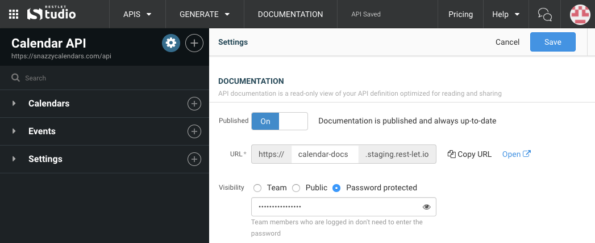

To control who can view your API documentation, go to the settings page, either by going to the *APIs* drop-down menu and clicking on *API Settings*, or by clicking on the gear icon in the left panel.

From the settings page, you can pick one of three visibility settings:

* **Team**: only you and your team members can access your documentation
* **Public**: anyone on the web with the link can access your documentation
* **Password protected**: only those with the password can access your documentation

