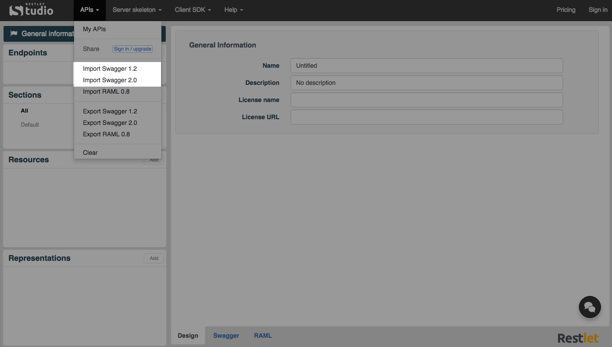
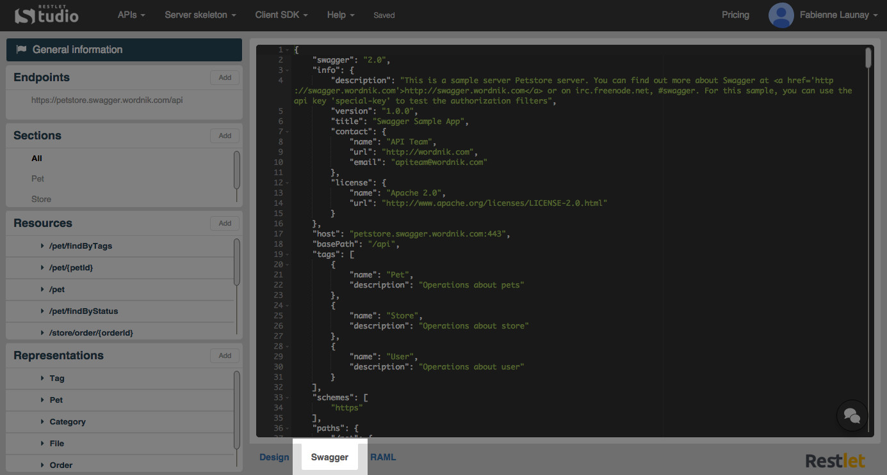
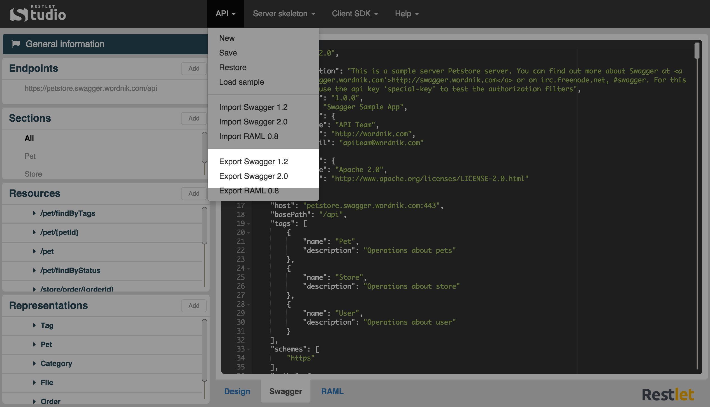

Swagger is an API description language that comes with number of tools including Swagger UI and Swagger Code Generator. Swagger UI provides a nice HTML presentation of your API’s contract and allows you to test your API by calling it. Swagger Code Generator generates client kits for your API in eight languages.

# Import your API declaration

Restlet Studio allows you to import your API declaration in Swagger 1.2 or 2.0 format. You can then edit it from Restlet Studio, download the server skeleton or client SDKs, etc.

If you have designed a web API declaration in Swagger, you can import and edit it from Restlet Studio.

Click on the **API** menu and select **Import Swagger 1.2** or **Import Swagger 2.0**.

Select the .json or .yml file that contains your API declaration.  

>**Note:** You can import a multi-file definition by uploading a zip archive. Click on **Choose a file** and browse to the zip archive you have chosen. From the **Main definition file** drop-down menu, select the  main file at the root of your API definition.

Select the appropriate radio button to **Replace** your current definition or to **Merge** it with the one you want to **Import**.

>**Note:** Restlet Studio informs you if some errors were detected in your Swagger 2.0 definition.

# View the Swagger definition of your API

Restlet Studio dynamically generates the Swagger description of web APIs. You can  view your API Swagger definition in the **Swagger** tab and also export this definition.

You can design your API without knowing Swagger syntax. But if you wish to see what your API looks like in Swagger 2.0 format, Restlet Studio provides you with a **Swagger** tab in Read-only mode.

Design your API in the **Web API** tab.
Click on the **Swagger** tab. You can copy and paste its content or just visualize it.

# Get your API definition in Swagger format

Once you have designed your web API, you can export it in Swagger 1.2 or 2.0 format.

Click on the **API** menu and select **Export Swagger 1.2** or **Export Swagger 2.0**.

Download the .json file that contains your API definition.
