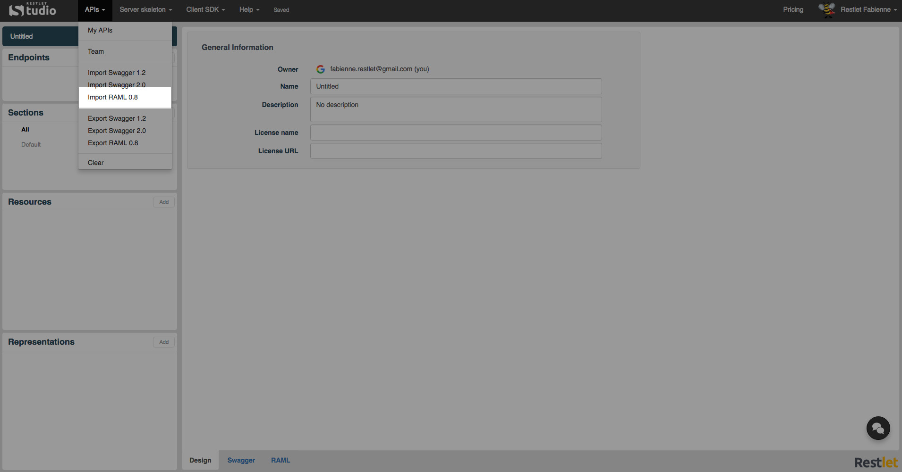
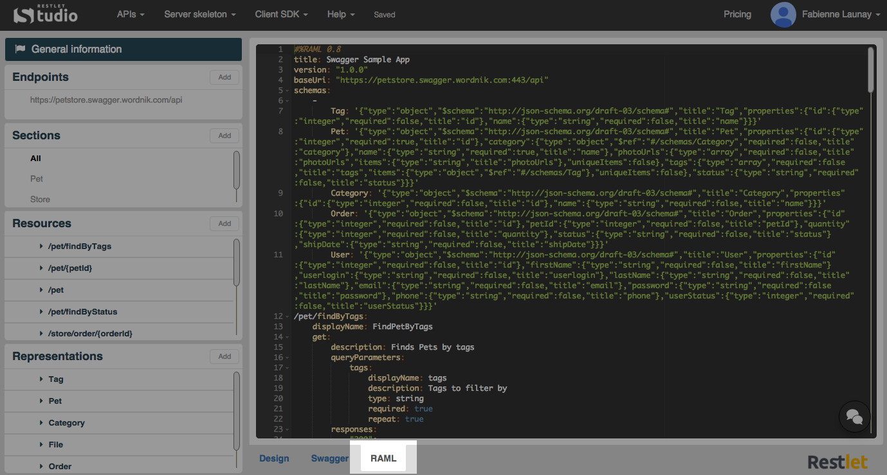
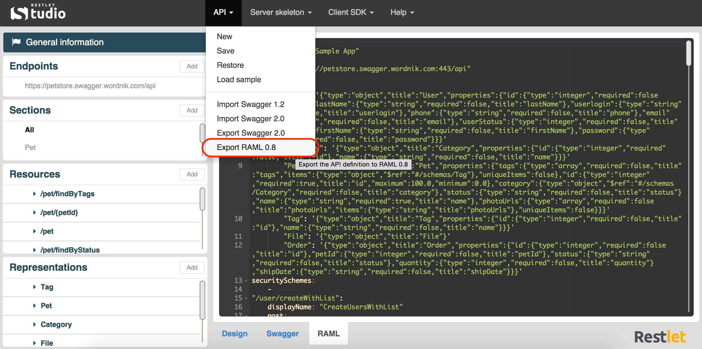

RAML (RESTful API Modeling Language) is a YAML-based, simple and succinct language that describes RESTful APIs. It is built on broadly-used standards such as YAML and JSON.

# Import your API declaration

Restlet Studio allows you to import your API declaration in RAML 0.8 format. You can then edit it from Restlet Studio, download the server skeleton or client SDKs, etc.

If you have designed a web API declaration in RAML, you can import and edit it from Restlet Studio.

Click on the **API** menu and select **Import RAML 0.8**.

Select the .yml file that contains your API declaration.  

>**Note:** You can import a multi-file definition by uploading a zip archive. Click on **Choose a file** and browse to the zip archive you have chosen. From the **Main definition file** drop-down menu, select the  main file at the root of your API definition.

Select the appropriate radio button to **Replace** your current definition or to **Merge** it with the one you want to **Import**.

>**Note:** Restlet Studio informs you if some errors were detected in your RAML definition.

# View the RAML definition of your API

Restlet Studio dynamically generates the RAML description of web APIs. You can  view your API RAML definition in the **RAML** tab and also export this definition.

You can design your API without knowing RAML syntax. But if you wish to see what your API looks like in RAML format, Restlet Studio provides you with a **RAML** tab.

Design your API in the **Web API** tab.
Click on the **RAML** tab. You can copy and paste its content or just visualize it.

# Get your API definition in RAML format

Once you have designed your web API, you can export it in RAML format.

Click on the **API** menu and select **Export RAML 0.8**.

Download the .yml file that contains your API definition.
