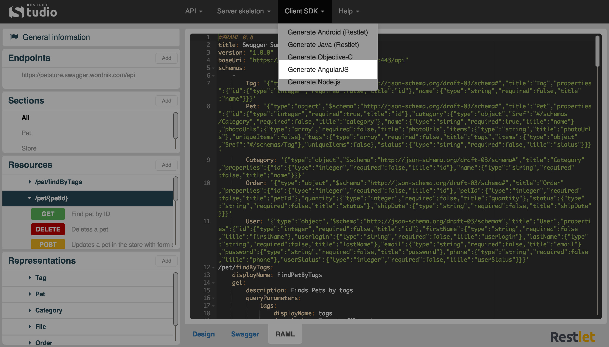

Restlet Studio provides you with client SDKs (Software Development Kit) and server skeletons which avoids you repetitive and non qualitative work that often leads to bugs.  

Restlet Studio allows you to get an AngularJS SDK for your web API.

# Get the AngularJS SDK for your API

Once you have designed your web API, you can export its AngularJS SDK.

Click on the **Clients SDK** menu and select **Generate AngularJS**.

Download the .zip file that contains your AngularJS SDK.
