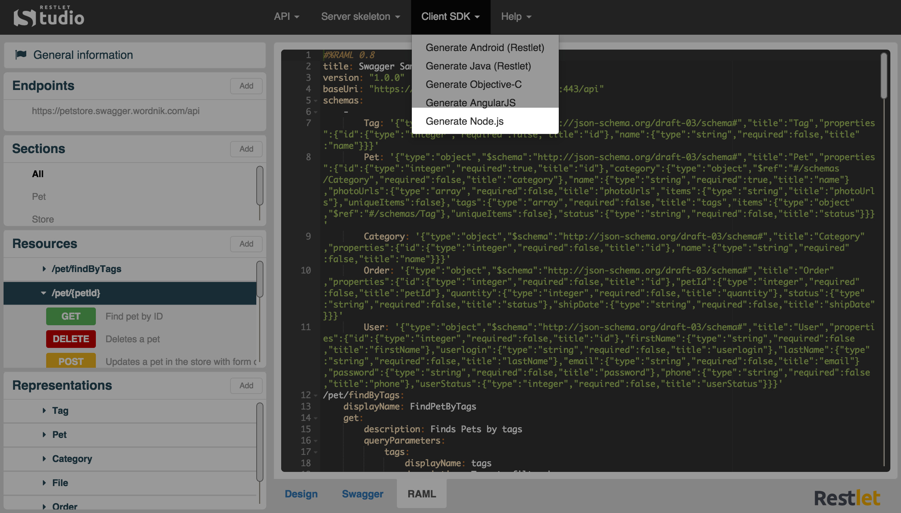

Restlet Studio provides you with client SDKs (Software Development Kit) and server skeletons which avoids you repetitive and non qualitative work that often leads to bugs.  

Restlet Studio allows you to get an Node.js SDK for your web API.

# Get the Node.js SDK for your API

Once you have designed your web API, you can export its Node.js SDK.

Click on the **Clients SDK** menu and select **Generate Node.js**.

Download the .zip file that contains your Node.js SDK.
