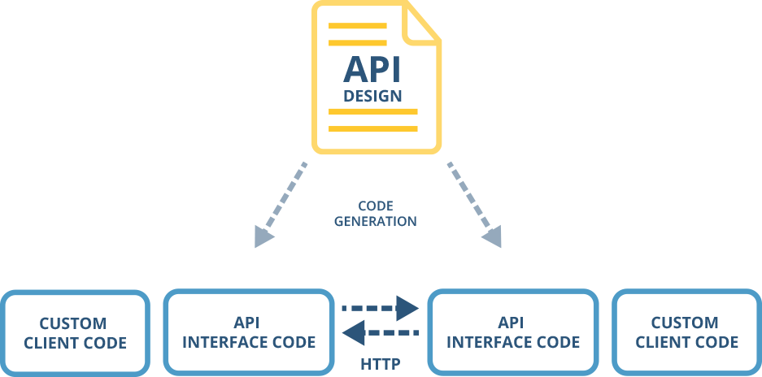

Restlet Studio helps developers during the implementation phase of their API project by generating code stubs.

Code stubs are libraries of code that handle the interface layer between your API and either a server or client application.

Because this code is repetitive and boring to write manually, and because it needs to be 100% conform to the API design in order to work properly, generating these code libraries saves developers a lot of time and effort.

There are two main types of code generators available in Restlet Studio: *server skeletons* for the server-side, and *client SDKs* for the client side. Different programming languages and frameworks are supported in each case.

