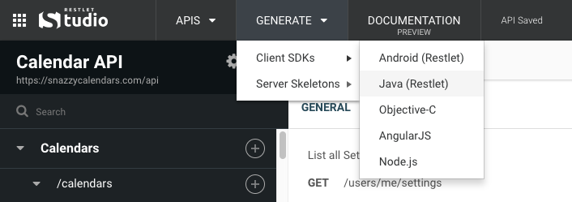

Client SDKs are code libraries that manage the API interface layer between the network and your custom client code.

To download a client SDK, head to the **GENERATE** menu in the header bar.

Each generated client SDK includes a readme file that explains how to get started.
