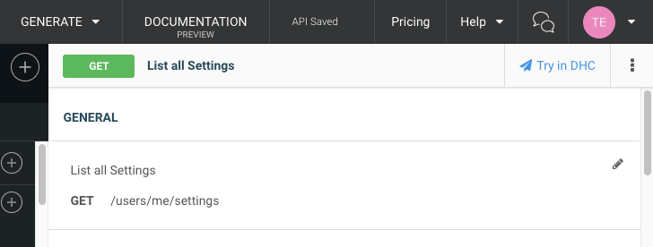
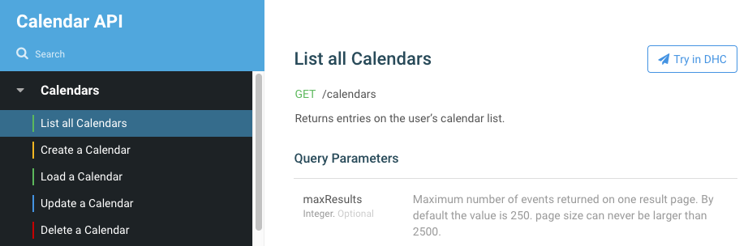

During the implementation phase of your API project, you'll regularly need to interact with you API to verify its behavior.

Once the API is implemented, consumers will also need to explore the APIs capabilities as they work on their client implementation.

For both of these purposes, Restlet Studio includes a "Try in DHC" button, both in the editor view, and published documentation.

Try in DHC from the editor:

Try in DHC from published documentation:

Clicking the Try in DHC button will open DHC, Restlet's API testing tool, with a ready-to-go request on the chosen API operation.

If you have not yet installed DHC, you will be taken to the chrome store to install it. Note that once you have a Restlet account, you automatically have access to DHC (APISpark) with the same account.
