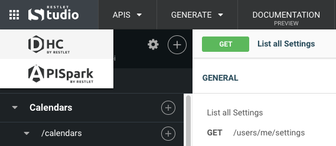

Every Restlet module has an app-switcher in the upper left corner, which makes it easy to go from designing or documenting and API, to testing it, and vice-versa.

Clicking on one of the modules in the app-switcher will open that app in a new tab.

