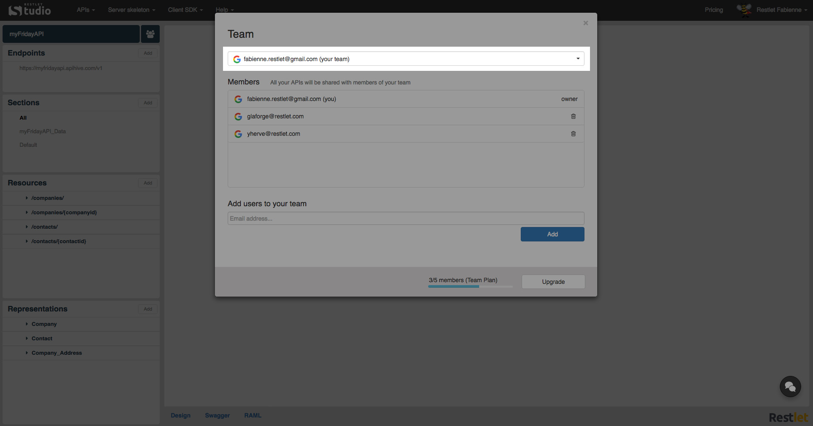
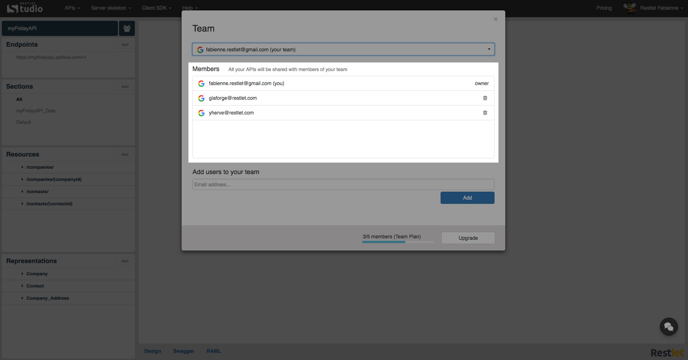
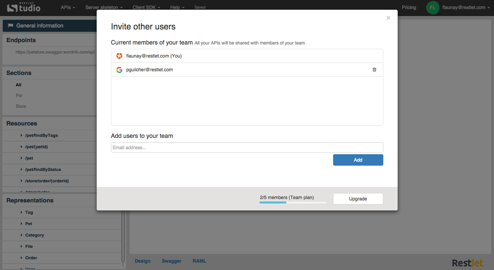

Restlet Studio allows you to share your APIs with members of your team (if you subscribed to a Team or Scale [plan](/technical-resources/restlet-studio/guide/get-started/subscribe "plans")). Your team members will see all your APIs and will be allowed to modify them.

# View your teams

Click on the **APIs** menu and select **Team**.  
From the top drop-down menu, select one of the teams you belong to (including yours).

The **Members** displayed underneath are those of the team selected above.  

>**Note:** You can delete members of your own team by clicking the recycle bin button displayed on the right of each member except you.

# Add users to your team

Click on the **APIs** menu and select **Team**.  
In the **Add users to your team** field, enter the email address of a user you want to add to your team and click **Add**.

>**Note:** At the bottom of the window, you can see the number of members you added to your team and the number of members you are allowed according to the plan you subscribed to (Here 3/5). If you need to add more members, click **Upgrade**.
