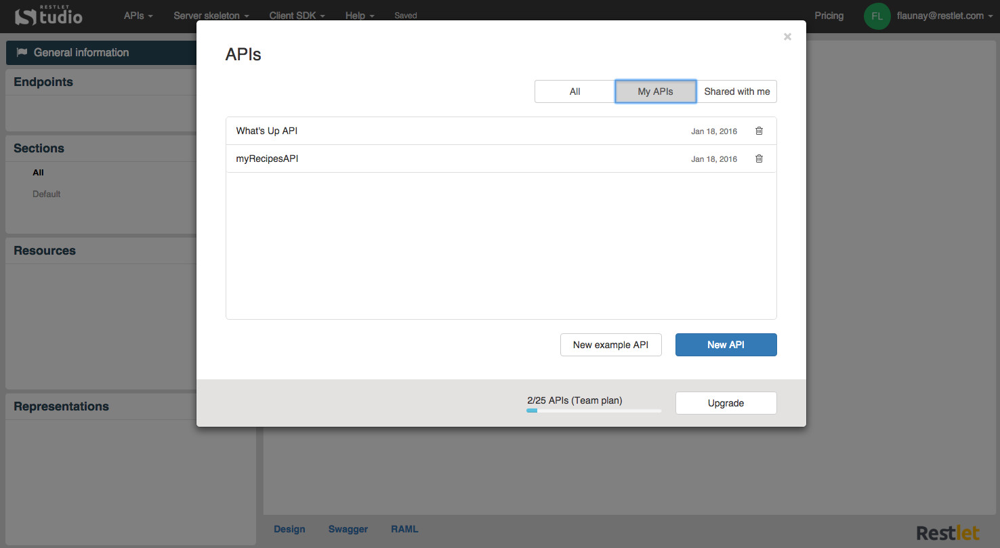
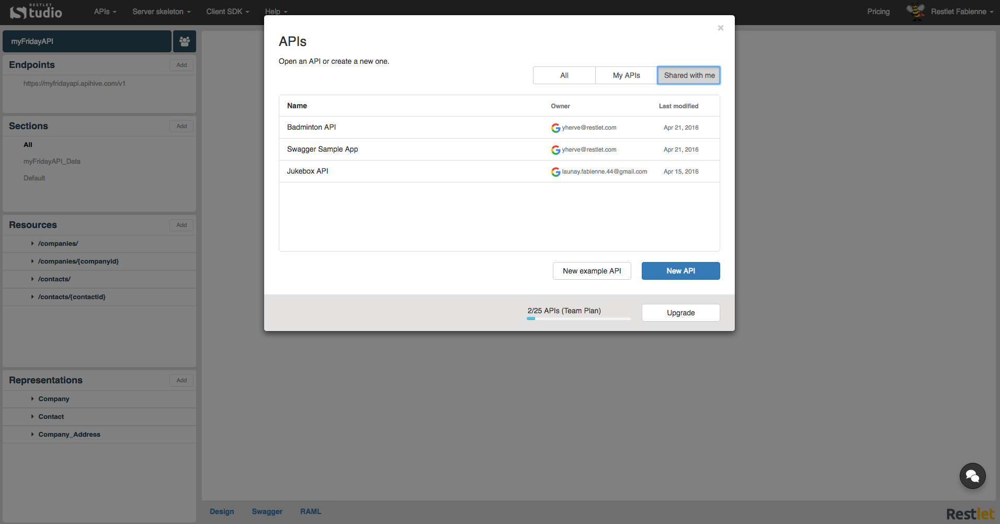
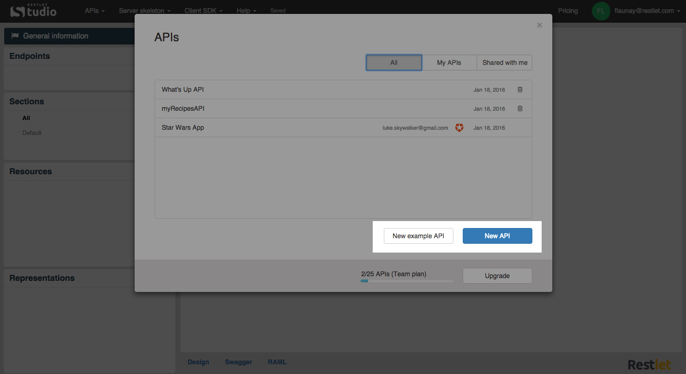
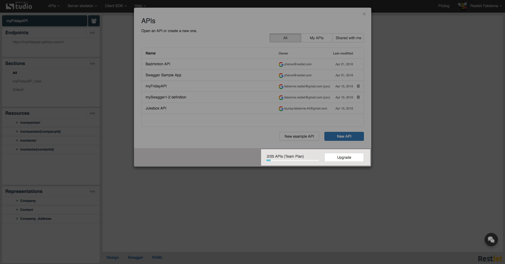

Restlet Studio allows you to create several APIs and to [share them with members of your team](/technical-resources/restlet-studio/guide/share/manage-team "share"). Your **APIs** page allows you to manage your APIs.

The **All** tab gives you the list of all the APIs you have access to (yours and those of your team).

The **My APIs** tab gives you the list of the APIs you created (and you share with the members of your team if any). You can delete your APIs by clicking the recycle bin button.

The **Shared with me** tab gives you the list of the APIs your members share with you. You can modify their APIs but you cannot delete them.

From your **APIs** page, you can create a new API from scratch (with the **New API** button) or starting from a sample (with the **New example API** button).

The number of APIs you are allowed to create depends on the plan you subscribed to and it is reminded at the bottom of your **APIs** page.
You can also upgrade to a higher plan if needed by clicking the **Upgrade** button.

