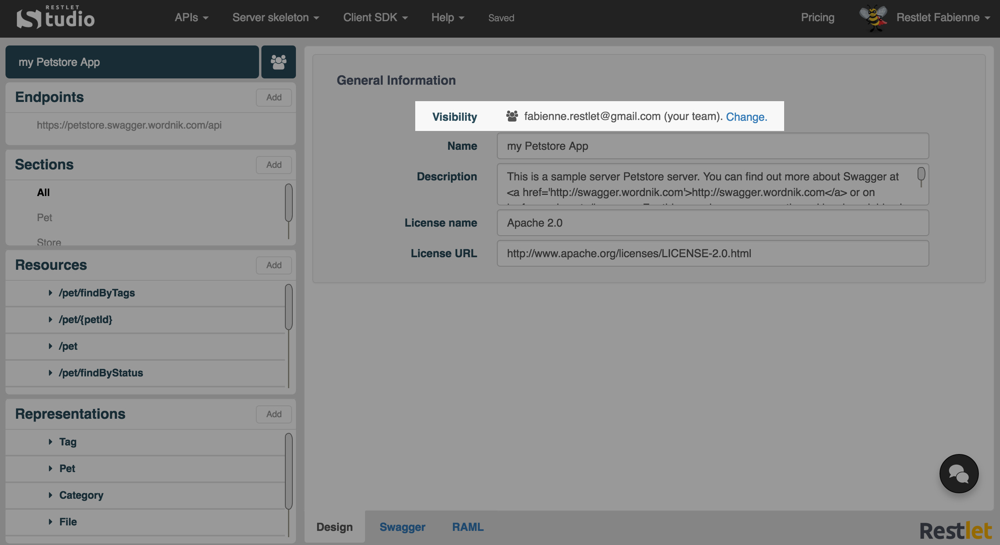
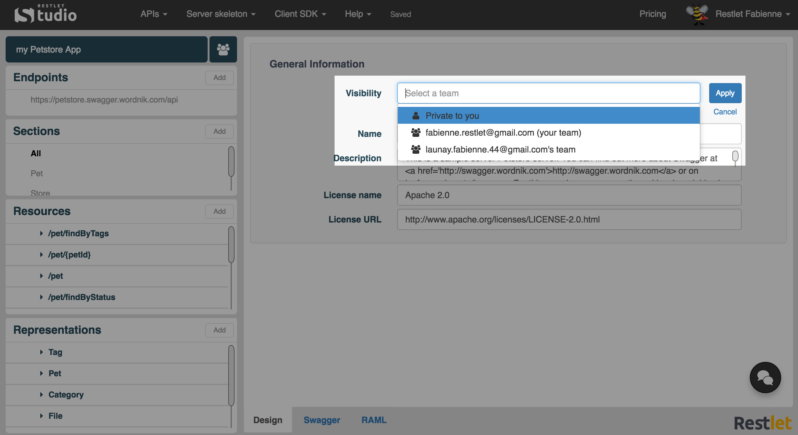

# Introduction

You can share your API definitions with members of your team who can also share their API definitions with you.

So you can decide to create an API definition and keep it private by setting its visibility to *Private*. You can also be willing to share it with your team. The last option is to share it with another team you belong to by transferring its ownership to the team owner.

The API visibility can be modified from the [General information panel](/technical-resources/restlet-studio/guide/craft/general-info "General information panel") or from the [APIs page](/technical-resources/restlet-studio/guide/share/manage-apis "APIs page").

>**Note:** Sharing APIs is only available with a Team or a Scale plan. Downgrading to Solo plan will automatically make all your APIs private.

# Change visibility

Navigate to the General Information section of an API or to your APIs page (**APIs** / **My APIs**).  
Click **Change**.  

Select the appropriate visibility and **Apply** it.

# Visibility types

- **Private to you**  
Selecting **Private to you** will make this API private. This means your team members will no longer be able to see it.

- **your team**  
Selecting **your team** means that you will share this API with the members of your team.

- another member**'s team**  
Selecting another member**'s team** will permanently transfer this API to another team you belong to.
