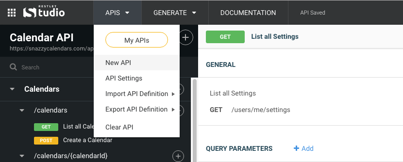
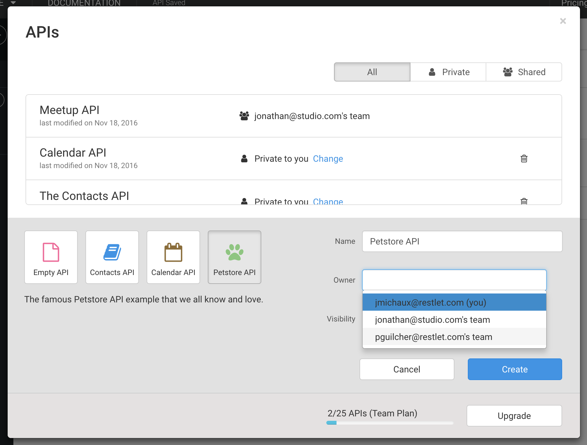

To create a new API, open the **APIs** drop down menu in the header bar, and select **New API**.

This will open the **My APIs** screen, from which you can either create a new API from scratch or start from one of our API examples, such as the *Contacts API* or *Calendar API*.

# Creating an API for your team

If you're a member of one or more teams, you can directly create an API on behalf of one of those teams. Simply choose which team the API should belong to from the owner drop-down.

# Why can't I create any more APIs?

Each plan comes with a maximum number of APIs you can create. When you've reached the maximum allowed number of APIs for your plan, you will no longer be able to create new ones. You'll have to upgrade your plan, or delete an existing API in order to continue.
