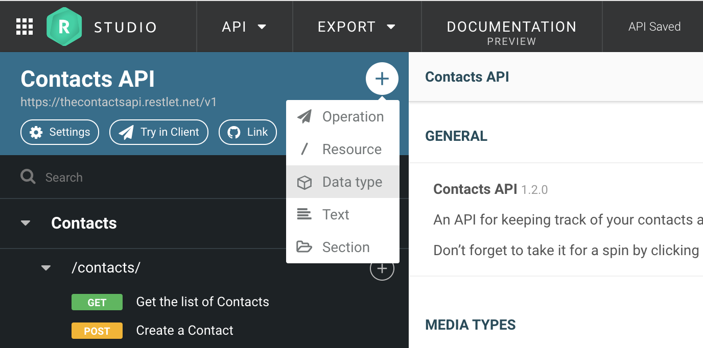
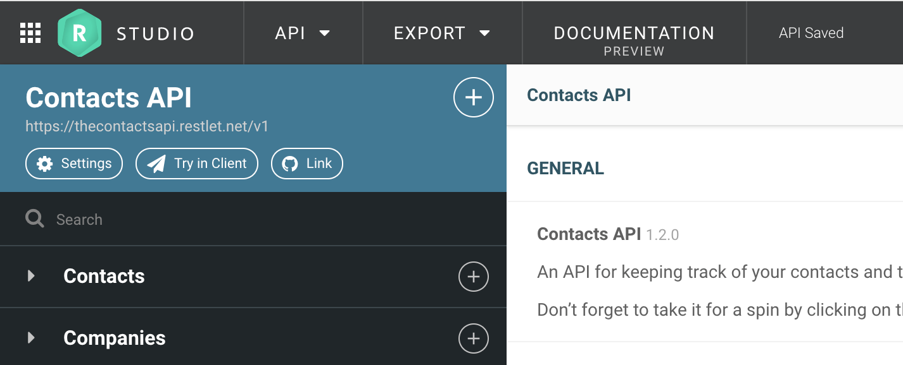

# Going from requirements to an API

So you've been tasked with designing an API? Congratulations, you're an API designer now!

Like most technology, an API is a solution to a problem. In order to design the right API, you'll need to make sure the problem you are addressing is clearly defined by answering the following questions:

* Who are the target consumers of this API?
* What kind of information will consumers manipulate via the API?
* What actions will consumers perform on the API?

For example, if you are a food delivery company, you might want to build an API for your partner network that will enable them to browse and search through a database of restaurants for which you provide a delivery service.

In this example, your API is targeting partners of your company. They'll need to manipulate data about restaurants, and perform search queries on the data, with certain filtering and sorting capabilities.

Another example: if you are a calendar SaaS company, you might want to build an API so that other front-end developers in the world can create new mobile and web applications based on your calendar system.

Thinking about the consumers of your API first is the first step towards providing them with a good developer experience. This will help your API stand out and increase engagement levels.

# The elements that make up an API

There are three key concepts used when designing an API:

* **Resources** are elements your consumers will interact with through your API. Resources are uniquely identified by a path, which combined with the API's endpoint provides a unique address for a resource on the web. For example, *Calendars* is the name of a resource that corresponds to a list of calendars, and its path is */calendars*.
* **Operations** are the actions that can be performed on your resources. The most common operations are GET (read), POST (create), PUT (update) and DELETE. For example, *List all Calendars* is the name of an operation that uses the *GET* method on the *Calendars* resource.
* **Data types** are descriptions of the actual data that is exchanged over the network. For example, *Calendar* is the name of a data type which will describe all the properties of a Calendar, such as its name, owner, and a reference to the events that belong to it. The *List all Calendars* operation returns a list of *Calendar* data types.

There are other elements that make up an API that are also very useful:

* **Endpoints** are the main entry point for your API on the web. An endpoint is composed of a scheme such as *HTTPS*, and a host such as www.calendar-api.com.
* **Text blocks** can be used to freely enter any text (including markdown) which can be positioned anywhere in your API design. Use text blocks to explain transversal topics like authentication and error handling.
* **Sections** are used to meaningfully group together resources and data types. Use these to make your API design clearer and more developer friendly. You can drag and drop elements into sections in the left panel, and you can also reorder sections among each other.

In **Restlet Studio**, you'll be able to create these elements from the **+** menu in the left panel.

Endpoints are created in the general information screen, which you can access by clicking on the name of your API at the top of the left panel.

