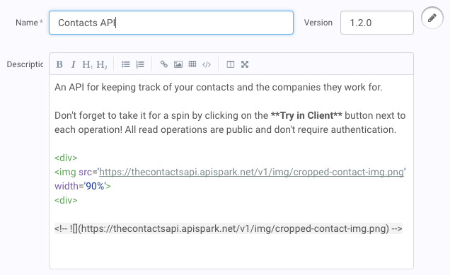

# What is markdown and why should I use it?

Markdown is a simple markup language, which lets you enhance plain text by adding formatting to it.

With markdown, you can make a boring paragraph of text stand out by adding headers, bold and italics, images, links, and all sorts of other things.

Restlet Studio makes markdown easy even for beginners. Thanks to the built in editor you don't even need to know markdown syntax in order to use it!

There are different flavors of markdown, and Restlet Studio supports <a href="http://spec.commonmark.org/0.25">CommonMark</a>, <a href="https://help.github.com/articles/organizing-information-with-tables/">tables</a> and emojis, and a few others.

# Where can I use markdown?

You can use markdown in all description fields, as well as in text blocks.

An easy way to know if markdown is supported is when the markdown toolbar appears at the top of the text input box.

Markdown enabled text boxes allow you to enter fullscreen mode with both markdown and rendered views open at the same time. Just hit the split window icon in the right part of the markdown toolbar.
