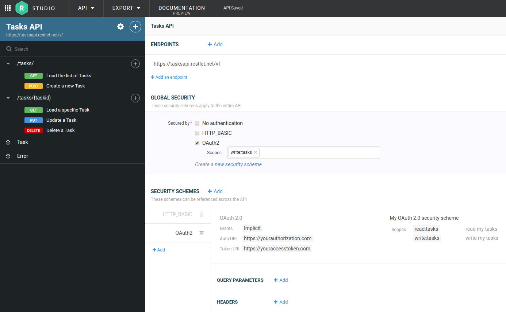
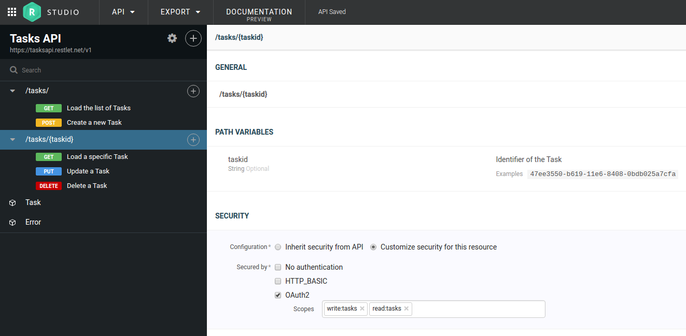

You want to design a secure API? Yes, defining your API access security is an essential requirement.

You may want simply define a common security for all your API, or choose a finer policy with a specific security 
for a critical resource? 

You may want to give a free access to your search products operation ?

No problem, Restlet Studio allows you to define all these cases with the main security types :

- Basic authentication
- Digest authentication
- OAuth 1.0
- OAuth 2.0
- Pass through
- Custom / API key

Let's se how to do that in Restlet Studio.

# How to design your API security in Restlet Studio

To begin to define your API security you first need to define your security schemes.

Then you can define the global security for all your API by selecting the security schemes you want to apply 
globally. By default, your global security will apply to all your resources and operations in your API.

Finally you can define a different security for each operation or all operations in a resource.

## Define your security schemes and your API global security

To define your security schemes, go to your API's general information and add your schemes.
Then select your security schemes you want to apply globally in your API.

## Define a specific security on a resource or an operation

To define a specific security for a resource, select your resource and choose your security schemes you
 want to apply to all your resource's operations. Then, you can select an operation to define its specific security.
  

## That's it, you know how to define your API security!
Please contact support via the in-app chat widget if you need more information to define your API security, we're happy
 to help!