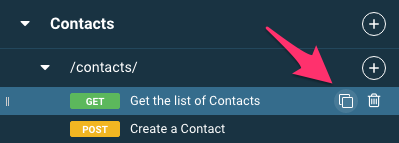

These tips and tricks will help you work faster on those bigger API designs.

# Clone API elements

You can clone any of the resources, operations, data types, and text blocks in the left panel.

The first way to do this is to use the menu in the top right of the right panel.

The second is to click on the clone icon in the left panel.

