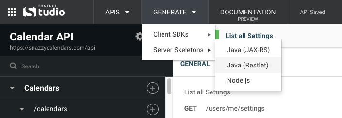

Server skeletons are code libraries that manage the API interface layer between the network and your custom server code.

To download a server skeleton, head to the **GENERATE** menu in the header bar.

Each generated server skeleton includes a readme file that explains how to get started.
