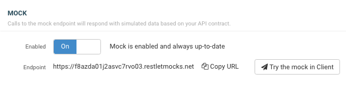

Every Restlet Studio API comes with an integrated mock API hosted by Restlet.

To activate your mock API, navigate to the settings page (near your API's name at the top left of the screen), scroll down to the Mock section, and hit enable.

When you active an API mock, the mock's endpoint will be added to your API contract, and is visible at the top of the left panel:

This endpoint will also be visible in API documentation that you publish from Restlet Studio.

It is important to note that the first endpoint in the list of endpoints will be selected when you use features like exporting OAS, generating code, and trying your API in Client.

You can reorder endpoints at anytime via the general information panel (accessed by clicking on your API's name in the top left).  
