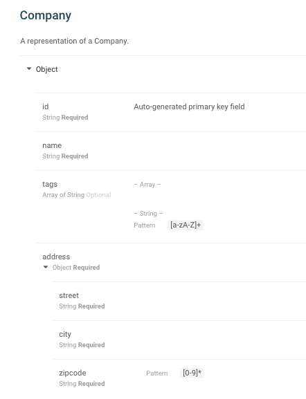
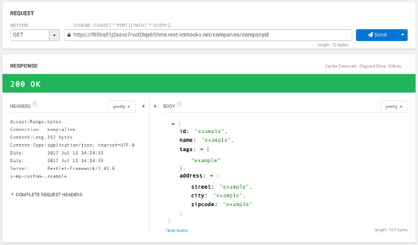
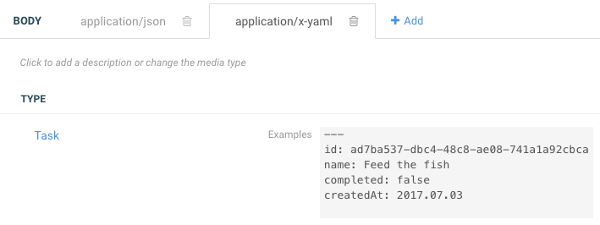

Once you have enabled an API mock, it is immediately available for use, and hosted on Restlet's cloud.

Any changes you make to your API contract are immediately reflected in your API mock.

# How does the mock generate responses?

Restlet API mocks will do their best to respond as realistically as possible to any calls it receives. When generating a response body, a mock will give priority to user-provided data by looking for an example field, then a default value, then an enum field. If one is found, it will be used as an example, otherwise a JSON example will be generated based on the data type returned by the operation being called.

As an example, consider the Company data type definition shown below. It does not contain any user-provided examples.

When mocking is activated, a GET call made to the /company/{companyId} resource will return an automatically generated JSON response based on the structure of the data type, as shown below using Restlet Client.

Note how the mock has done a number of interesting things for us including generating values for custom response headers (e.g. *x-my-custom-header*), identifying arrays and creating appropriate examples (e.g. *tags* property), and also identifying nested structures and generating values for those too (e.g. *address* property).

Restlet Studio mocks support content negotiation, so you can use the *Accept* request header to select which body should be returned among several options (each potentially has its own example), therefore changing the examples returned by the mock.

# Making calls to your API mock

The easiest way to start interacting with your API mock is to start making requests to it from Restlet Client, the HTTP client and testing tool built by Restlet and available as a Google Chrome extension.

If you keep the mock endpoint as the first in the list of endpoints in your API contract, then all usage of the Try in Client feature will open Restlet Client (or ask you to install it from the Chrome Store) and create requests that target your mock.

There are two main ways to open Restlet Client from your API definition. You can either open the entire API as a new project in Restlet Client by hitting the Try in Client button at the top left near your API's name. You can also try individual operations by hitting the Try in Client button on any operation's page in the editor, or next to the operation's name in published documentation.
