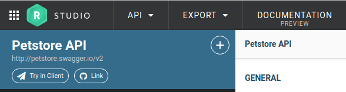
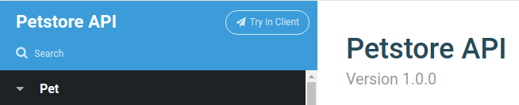
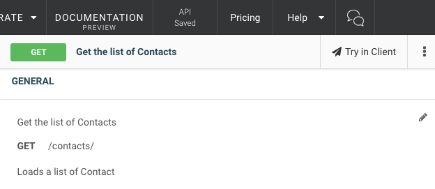
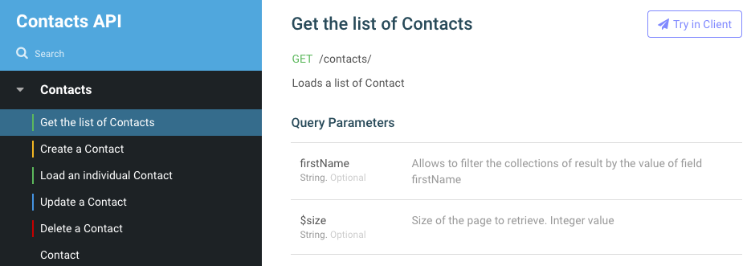

During the implementation phase of your API project, you'll regularly need to interact with you API to verify its behavior.

Once the API is implemented, consumers will also need to explore the API's capabilities as they work on their client implementation.

You can either export:

* your whole API definition : a project is created with pre-defined requests for each of the API’s operations. You will then be able to set up complex scenarios that emulate real-life usages of your API.
* a single operation : Restlet Client is opened with a ready-to-go request *for the selected* API operation

For both of these purposes, Restlet Studio includes a "Try in Client" button, both in the editor view, and published documentation.

If you have not yet installed Restlet Client, you will be redirected to the chrome store to install it. Note that once you have a Restlet account, you automatically have access to all modules, including Restlet Client and Restlet Cloud, with the same account.

## Try an API in Restlet Client

Try in Restlet Client from the editor:

Try in Restlet Client from published documentation:

## Try an operation in Restlet Client

Try in Restlet Client from the editor:

Try in Restlet Client from published documentation:

## Technical details

| Restlet Studio item | Corresponding Restlet Client item | Comments
|---------------------|-----------------------------------|---------
| API | root project | Single project, which name is given by the name of the API in Restlet Studio.
| Section | services |
| Operation | requests | Each operation of each resource located inside the same section are gathered under the same service. Path variables, query parameters and headers are imported too.

When you import another time an API from Studio, elements are matched thanks to their name so that the existing items in Client are overwritten (except the assertions, which are specific to Client), but no Client items are deleted.
That is to say, if you rename an operation in Studio, the related request with the original name will be kept in Client.
