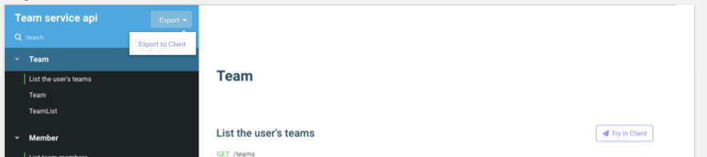

One of the goals of the Restlet Platform is to make it easy to go from API design to API testing with minimal fuss.

Restlet achieves this by leveraging the API design you created in Studio in order to create tests in Restlet Client.

First, open an existing API or create a new one in Restlet Studio.

When your API design is ready, click on the *Export to Client* button in the *Export* menu from Restlet Studio's header bar.

You can also use the *Export* menu from your published Studio API documentation as shown below (click [here](https://restlet.com/documentation/studio/user-guide/documentation/introduction) to learn more about how to publish your API documentation).

This will create a new project in Restlet Client, Restlet's API testing tool. The project will contain pre-configured requests based on what was described in your API contract. You can now use these requests to build test scenarios for your API. Learn more about writing test scenarios [here](https://restlet.com/documentation/client/user-guide/run-tests/scenarios).

The next time you click on the export button from Restlet Studio, your Restlet Client test project will be updated with any changes you made on your contract. This means you can iterate on your designs and your tests while keeping everything up to date.

So when should you use this workflow? Try using it to make sure your API implementation is conform to the API contract by creating tests that are directly based on the elements in the API's contract definition.
