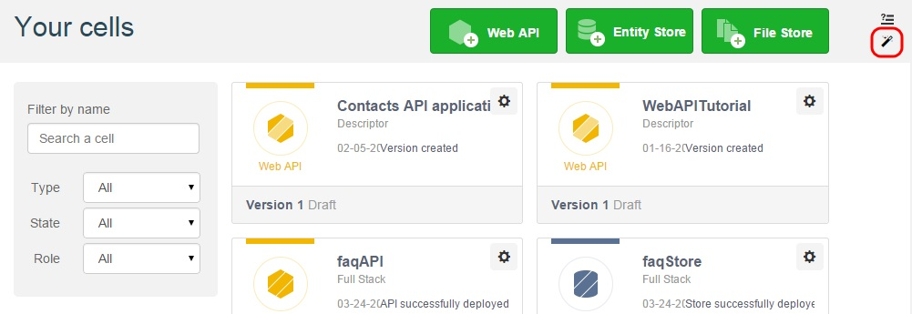
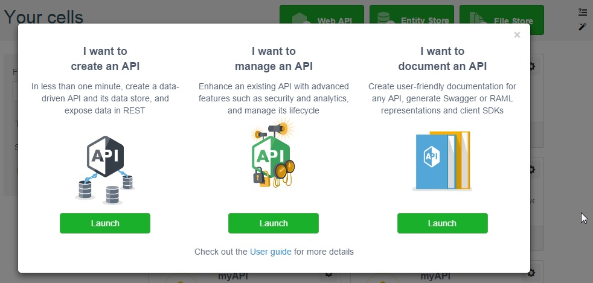

APISpark Quickstart wizard launches automatically if your **Dashboard** is empty. To help you start from scratch, the Quickstart wizard will guide you through the creation of your first cells (Entity Store, API, Connector and Descriptor). So do not be afraid to suffer from writer's block, APISpark guides you through your first steps in the console.

You can also launch the Quickstart wizard at any time from the **Dashboard** by clicking the Quickstart wizard icon in the upper right corner of your screen.

The Quickstart wizard allows you to:
- create an API and its data store,
- manage an existing API or
- document an existing API.

Click the appropriate **Launch** button and you will be guided through the creation process.

